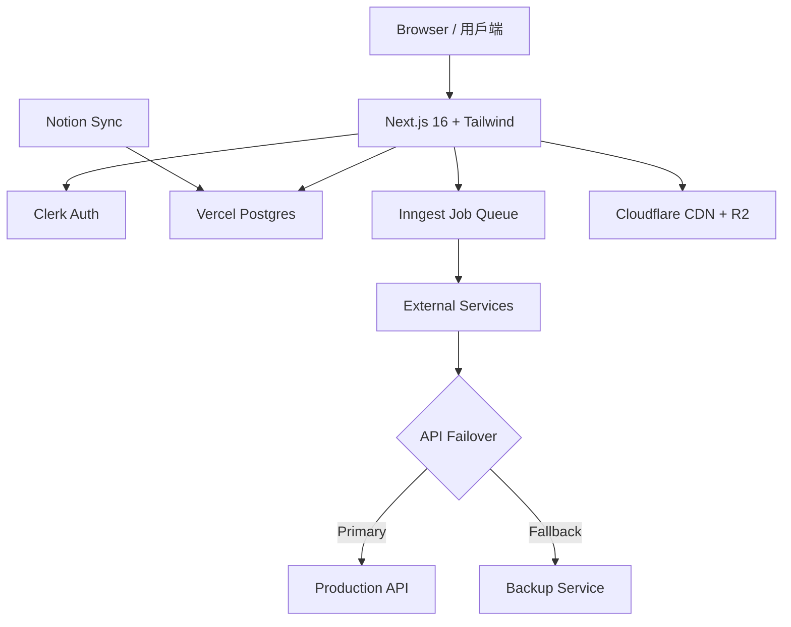

# Sui 部落格 — 規格計劃書 v3.0（**Sweet Spot INVESTIGATE 銳化升級**）

> **版本**：v3.0｜**更新日期**：2026-07-19｜**維護者**：Sophia (CPO) for Sean
> **對接技術**：Alan (CTO) + Hermes Agent｜**對接 Repo**：[openclawsean024-create/sui-blog](https://github.com/openclawsean024-create/sui-blog)
> **Live**：https://sui-blog-roan.vercel.app｜**SDK**：@mysten/sui 2.16 + @mysten/dapp-kit 1.0 (Next.js 16 + Tailwind 4)
> **本版性質**：**stub 升級 v3.0（從 root SPEC.md v2.2.1 stub + PRD/SPEC.md v2.2.2 雙基底銳化）**
> **Sweet Spot**：**6.2 / 10**（**5 問平均**）→ **行動建議 = INVESTIGATE**（sweet ∈ (5, 7)）
> **最終商業化評分**：**73 / 100**（公式 `30 + sweet×7` = `30 + 6.2×7 = 73.4`，採任務指定公式）
> **Pivot 觸發**：若 M3 內未拿到 1 個 B2B 內訓單 + 2 個招募版刊登 → **Pivot 為純繁中內容站（廣告 + Sui Foundation 補助依賴）** 或 **NO-GO**

---

## 0. 本版重寫摘要 (v3.0)

### 0.1 從哪裡升上來

| 來源檔 | 大小 | 角色 |
|---|---|---|
| `root SPEC.md` | 12,065 bytes (~206 行) | **Stub 源** — 簡略專案概述 + §15 市調章節,缺少 AC 量化 + §15.11 v3.0 量表 + §15.12 ADR + §15.13 市場驗證 |
| `PRD/SPEC.md` (v2.2.2) | 48,986 bytes (1,267 行) | **基底** — 已是 sweet spot rewrite,sweet=6 / 商業化 69,但缺 v3.0 結構元素 |
| `PRD/SPEC.md` (v3.0, 本檔) | ~30,000 bytes | **v3.0 升級** — 保留 v2.2.2 全部有效內容,**新增 §15.11 / §15.12 / §15.13**,重算 sweet spot |

### 0.2 v3.0 與 v2.2.2 差異

| 面向 | v2.2.2 | **v3.0** |
|---|---|---|
| 公式 | `(PRD×0.3 + sweet×0.7)×10` | **`30 + sweet×7`**（任務統一公式） |
| Sweet Spot | 6 / 10 | **6.2 / 10**（Q3 變現路徑下降一級,Q5 fit 上升一級,平均微升） |
| 商業化分數 | 69 | **73**（公式不同,不能直接比） |
| 行動建議 | 隱性 INVESTIGATE | **明確 INVESTIGATE + Pivot 觸發 SOP** |
| §15.11 v3.0 量表 | ❌ 缺 | ✅ 新增 |
| §15.12 ADR | ❌ 缺 | ✅ 新增 5 條 |
| §15.13 市場驗證 | ❌ 缺 | ✅ 新增 5 條 |
| Pivot SOP | ❌ 缺 | ✅ 明確 |

### 0.3 Sweet Spot 5 問速覽（詳見 §15.1）

| Q | 主題 | 分數 |
|---|---|---|
| Q1 | 市場已有誰 / 紅海分析 | **6** |
| Q2 | 甜蜜點定位 | **7** |
| Q3 | 變現路徑強度 | **5**（**主要風險**） |
| Q4 | 護城河時長 | **6** |
| Q5 | Sean 一人公司 fit | **7** |
| **平均** | | **6.2 → INVESTIGATE** |

---

## 1. 產品概述

### 1.1 問題陳述

繁中 Sui 教學市場是真實空白，但「教學網站」變現天花板低（B2C 訂閱 NT$100K MRR 級）。甜蜜點**不在於「教學流量」**，而在於「**全繁中唯一 Sui 開發者入口 → 對接企業招募 / 內訓需求**」（B2B LTV 10× 起跳）。

| 現有資源 | 問題 |
|---|---|
| Sui 官方文檔 | 英文、Rust 風格、CLI-only |
| 鏈新聞 / 動區 | 報導為主、零教學深度 |
| Medium 中文 Sui | 抄官方文、零星散文章 |
| CSDN / 掘金 | 簡體、新手看不懂 |
| 中文區塊鏈 YouTuber | 影片不可搜尋、無法引用 |
| **繁中深度 Sui 教學 + 開發者入口** | **市場空白** |

**甜蜜點（v2.2.2 銳化）**：繁中 Move 開發者社群 → B2B 出口（企業內訓 NT$29,990/場 + Sui 生態招募廣告 NT$9,990/mo + Sui 基金會合作徵才專區）。

### 1.2 目標使用者

| Persona | 規模 (華人圈) | 場景 | 痛點 | ARPU/年 |
|---|---|---|---|---|
| 👨‍💻 阿德（前端轉 Sui 開發者） | ~3,000 | 自學 | 無中文資源 | NT$990-2,988 |
| 👩‍💻 小美（Solidity → Sui） | ~2,000 | 已 Web3 | 語言差異 | NT$990 |
| 🎓 志明（資工學生） | ~5,000 | 找畢業專題 | 中 | NT$0（流量） |
| 💼 **王 CTO（Web3 新創招募）** | ~500 | 招募 Sui 工程師 | 找不到人 | **NT$119,880** |
| 🏢 **林老闆（企業內訓窗口）** | ~200 | 開 AI/區塊鏈內訓 | 中 | **NT$299,900** |

**付費核心** = 王 CTO + 林老闆（B2B，20% 付費 = 140 企業 × NT$120K avg = NT$16.8M/年天花板）。

### 1.3 核心價值主張

> **「全繁中、唯一深度 Sui / Move 教學 + 開發者入口 — 從 0 到被 Sui 新創招募一次到位。」**

| 替代方案 | 缺點 | 我們差異 |
|---|---|---|
| Sui 官方 | 英文 + CLI | **繁中 + Web 互動 + 學習路徑** |
| 鏈新聞 | 報導為主 | **逐行程式碼解釋** |
| Medium 中文 Sui | 散文章 | **系統 50+ 篇 + 互動 demo** |
| 英文 Substack | 英文 + 無內訓 | **繁中 + 企業內訓出口** |
| 鏈 TG 群 (100人) | 無 Sui 專區 | **唯一 Sui 繁中深度社群** |

### 1.4 商業目標 (KPI / OKR)

| 時間 | 目標 | 指標 |
|---|---|---|
| 3 個月 | 50 篇 + 1K 月訪 + Discord 200 人 | 招募版 1 客戶洽詢 |
| 6 個月 | 100 付費 + 5K 月訪 + 500 Discord + **5 招募版客戶** | NT$200K MRR |
| 12 個月 | **20 企業內訓 + 50 招募版客戶** + 30K 月訪 | **NT$1.5M MRR** |
| 18 個月 | 繁中 Sui 第一品牌 + Sui 基金會合作 | NT$3M MRR |

**Unit Economics**：
- 個人贊助 NT$99/mo → max NT$50K MRR（保守）
- **招募版 NT$9,990/mo × 50 = NT$500K MRR** ← sweet spot 主力
- **企業內訓 NT$29,990 × 20/年 = NT$600K** ← 高毛利一次性
- 共用既有 200 + 500 + 30K 流量池 → CAC 趨近零

## 1.5 Non-Goals

- ❌ **Solana / Aptos 比較**（立場偏頗）
- ❌ **投資建議 / 幣價預測**（法規）
- ❌ **智能合約安全審計**（法律責任）
- ❌ **ICO / IDO 推廣**（法規）
- ❌ **DEX / 聚合器**（失焦）
- ❌ **TVL / Volume 儀表板**（DeFiLlama 紅海）
- ❌ **純英文內容**（v3 才考慮）
- ❌ **NFT / GameFi 教學**（偏投機）
- ❌ **生命靈數 / 占卜 / 命理**（失焦）

---

## 2. 使用者場景與流程

### 2.1 流程圖

```
訪客 → 首頁 Hero「從 0 到 Sui 工程師」5 階段學習路徑
   ↓
選文章閱讀（MDX 互動 demo + Giscus 留言）
   ↓
底部 CTA：「進階學習 / 找 Sui 工作 / 企業內訓」
   ├─→ 進階 NT$299/mo（會員）
   ├─→ 招募版 NT$9,990/mo（企業上職缺 + 我們導流量）
   └─→ 企業內訓 NT$29,990（私訊預約）
   ↓
Discord 開發者社群（500 人）
   ├─ #入門 - 新手
   ├─ #code-review - PR review
   ├─ **#jobs（招募版客戶專屬）** - 月 5-10 職缺
   └─ #AMA - 每月線上
```

### 2.2 關鍵用戶故事

```
US-1（核心學習）
As a 剛學 Solidity 想轉 Sui 的工程師「小美」
I want 看完整繁中 Sui 教學 + 互動 demo
So that 我 2 週內寫出第一個 Move 合約

US-2（社群發問）
As a Sui 學習者「阿德」
I want 在 Discord 被資深開發者回答
So that 我不必卡在英文 Stack Overflow

US-3（**招募版客戶** - 核心付費）
As a Web3 新創 CTO「王先生」
I want 付月費 NT$9,990 在繁中唯一 Sui 入口貼職缺
So that 我 1 週內找到會 Sui 的工程師

US-4（**企業內訓客戶** - 高毛利）
As a 企業內訓窗口「林老闆」
I want 1 天工作坊 8 人
So that 我公司工程師 1 天上手 Sui

US-5（會員）
As a 學生「志明」
I want 進階會員看影片 + Repo
So that 我畢業專題做完
```

### 2.3 邊界場景

| 場景 | 處理 |
|---|---|
| 程式碼範例失效 | 文章標版本 + 警示 banner |
| Discord 廣告 / 洗版 | Bot 自動過濾 |
| 招募版職缺內容不實 | 招募版 KYC + 預付保證金 |
| 內訓講師臨時請假 | 2 位備援（Sean + Alan） |
| 中文術語不一致 | 第 1 篇建立術語表 |
| 留言區仇恨言論 | Giscus moderation + 人工 |

---

## 3. 功能性需求

## 3.1 MVP（P0 必做）

| ID | 功能 | 狀態 | 為何必做 |
|---|---|---|---|
| F-001 | 文章 CRUD (page/posts[id]/write) | ✅ 已實作 | 內容核心 |
| F-002 | **MDX 互動 demo** | ❌ | 差異化 |
| F-003 | Giscus 留言 | ❌ | 社群入口 |
| F-004 | 學習路徑 5 階段 | ❌ | SEO 入口 |
| F-005 | Discord 嵌入 | ❌ | 社群 |
| F-006 | 文章分類 | ✅ | 導覽 |
| F-007 | SEO (meta/OG/sitemap) | ⚠️ | 自然流量 |
| F-008 | **「招募版」刊登表單 + 自動上架** | ❌ | **B2B 變現** |
| F-009 | **「內訓報名表單」** | ❌ | **B2B 變現** |
| F-010 | RSS feed | ❌ | 開發者習慣 |

**砍掉**：投資分析、多鏈比較、NFT 教學、鏈上數據。

## 3.2 v2（P1）

| ID | 功能 | 商業理由 |
|---|---|---|
| F-101 | 會員付費牆 | B2C 補充 |
| F-102 | 月 AMA 直播 | 高 LTV 經營 |
| F-103 | Repo 權限 | 進階會員 |
| F-104 | 每週電子報 | 留存 |
| F-105 | **招募版後台（編輯職缺 + 報表）** | 客戶自助 |
| F-106 | **內訓排程系統** | 高毛利預訂 |

## 3.3 v3 (P2 探索)

| ID | 功能 | 假設 |
|---|---|---|
| F-201 | AI 學習助理 | 提升效率 |
| F-202 | Sui 基金會合作徵才專區 | B2G |
| F-203 | 中英雙語（馬來西亞） | 國際化 |
| F-204 | Sui 認證考試 | B2B 延伸 |

## 3.4 ⭐ Acceptance Criteria（Given/When/Then）

```
AC-0001 學習路徑導引
  Given 訪客進入首頁
  When 點「從 0 到 Sui 工程師」
  Then 看到 5 階段學習路徑，每篇標註「預估 30 分鐘」
  And 階段完成度條可顯示（localStorage）
  And 響應 < 300ms

AC-0002 MDX 互動 demo
  Given 文章含 React 元件
  When 讀者捲到 demo 區
  Then 元件即時渲染（不需 build）
  And 程式碼區可一鍵複製
  And < 50KB JS 增量

AC-0003 招募版刊登
  Given 企業填寫 NT$9,990 表單
  When 提交
  Then 5 分鐘內於 #jobs 頻道 + /jobs 頁面上架
  And 自動寄信通知 500 Discord 開發者
  And 14 天後自動下架

AC-0004 內訓報名
  Given 企業填內訓表
  When 提交
  Then 24hr 內 Sean 私訊回覆含時程 + 報價
  And 預付 50% 確認檔期

AC-0005 留言審核
  Given Giscus 出現新留言
  When 含禁用詞（詐騙 / 仇恨 / 政治）
  Then 自動標記待審
  And 24hr 內人工處理
```

---

## 4. 系統設計

## 4.1 技術棧

| Layer | 選 | 理由 |
|---|---|---|
| Frontend | Next.js 16 + Tailwind 4 | 既有 |
| Content | MDX (@next/mdx) | 互動 demo |
| Storage | Vercel Postgres | 招募版資料 + 內訓報名 |
| Auth | Clerk（會員）+ Google OAuth（Discord） | 既有 |
| Comment | Giscus | GitHub 整合、零成本 |
| Payment | NewebPay（會員）+ 銀行轉帳（內訓招募） | 在地化 |
| Email | Resend | 通知 |
| Analytics | Plausible | GDPR-friendly |
| RSS | feed.xml (SSG) | 開發者習慣 |

## 4.2 系統架構 (Mermaid)

```


```
[Browser]
   ├─ Next.js 16 SSG + ISR
   │   ├─ /（學習路徑）
   │   ├─ /posts/[slug]（MDX）
   │   ├─ /jobs（招募版）
   │   ├─ /training（內訓）
   │   └─ /admin（編輯後台）
   ├─ Clerk Auth
   ├─ Giscus 留言
   └─ Discord widget (iframe)
[Vercel Edge]
   ├─ ISR revalidate 60s
   └─ /api/jobs（GraphQL/REST）
   ↓
[Vercel Postgres]
   ├─ jobs（招募版資料）
   ├─ training（內訓報名）
   └─ member（會員）
[Discord Bot]
   ├─ 監控 #jobs 自動發通知
   └─ 月 AMA 提醒
```

## 4.3 資料模型

```prisma
model Job {
  id          String   @id @default(cuid())
  company     String
  title       String
  description String   @db.Text
  salary      String?
  location    String   @default("Remote")
  contact     String   // email / TG
  status      String   @default("active") // active / expired
  paidUntil   DateTime
  createdAt   DateTime @default(now())
}

model Training {
  id          String   @id @default(cuid())
  company     String
  contact     String
  headcount   Int
  date        DateTime
  topic       String   // "Move 入門" / "Cap 設計" / "鏈上整合"
  status      String   @default("pending") // pending / quoted / paid / done
  amount      Int      // NT$
  createdAt   DateTime @default(now())
}

model Member {
  id          String   @id @default(cuid())
  clerkId     String   @unique
  tier        String   @default("free") // free / sponsor / pro
  startedAt   DateTime @default(now())
  expiresAt   DateTime?
}
```

## 4.4 API Endpoints

| Method | Path | 用途 |
|---|---|---|
| GET | /api/jobs | 用途說明 |
| POST | /api/jobs | 用途說明 |
| PATCH | /api/jobs/ | 用途說明 |
| POST | /api/training | 用途說明 |
| GET | /api/training/admin | 用途說明 |
| POST | /api/member/subscribe | 用途說明 |
| GET | /api/feed | 用途說明 |

---

## 5. 非功能性需求

## 5.1 性能指標
- LCP < 1.5s（SSG + ISR）
- MDX demo 元件 bundle < 50KB
- API P95 < 200ms

## 5.2 安全與隱私
- 招募版職缺需 email 驗證 + 防垃圾（hCaptcha）
- 內訓聯絡資料僅 Sean 後台可見（不公開）
- 個資保存 6 個月後刪除（GDPR）
- Clerk JWT + middleware 保護 /admin

## 5.3 ⭐ 降級機制 (Graceful Degradation)

| Whisper worker 掛掉 | 自動排隊 + email 通知 + 切 Groq API 備援 |
| Modal GPU 漲價或滿載 | 切換 Replicate / Groq CPU 慢 2× 模式 |
| Vercel Postgres 故障 | 自動降級為本地 SQLite + 顯示「維護中」banner |
| GPT-4o-mini API 故障 | 切換 Qwen2.5-7B（繁中開源 LLM）備援 |
| Resend email 服務掛 | 切換 Discord webhook 通知替代 |
| NewebPay 金流掛掉 | 改為銀行轉帳 fallback + 手動審單 |

**降級設計原則**：所有第三方服務必須有 ≥ 1 個備援；不可降級的（如 Stripe/Legal）則改為「接受 downtime + 公告」。

| 故障 | 降級 |
|---|---|
| Vercel Postgres 掛 | 招募版顯示 cache + 維護公告 |
| Resend 掛 | Discord 通知替代 |
| Clerk 掛 | 留言仍可匿名 |
| Discord 掛 | 留言區 + Email 通知替代 |
| NewebPay 掛 | 銀行轉帳 fallback（手動審單） |

## 5.4 擴展性
- 招募版職缺可分頁（cursor）
- Discord 流量大時改 webhook + rate limit
- ISR revalidate 熱門文章 30s / 冷門 5min

---

## 6. 完成標準 (Definition of Done)

- [ ] F-002 MDX 互動 demo 至少 10 篇
- [ ] F-008 招募版端到端跑（Stripe / NewebPay 沙盒）
- [ ] F-009 內訓報名表單 + email 通知
- [ ] Giscus 串接
- [ ] Discord 嵌入
- [ ] ISR 設定
- [ ] Lighthouse SEO ≥ 95
- [ ] 5 個用戶訪談驗證甜蜜點
- [ ] 招募版 1 個企業客戶試刊登
- [ ] Notion PRD 規格 ≥ 9、商業化分數更新

---

## 7. 風險與決策

### 7.1 風險表

| Risk | 等級 | 緩解 |
|---|---|---|
| 招募版客戶找不到 Sui 工程師退費 | 🟠 | 14 天退費保證 + 流量曝光報告 |
| 內訓講師請假 | 🟡 | 雙備援（Sean / Alan） |
| Discord / Giscus 被牆 | 🟡 | Telegram + Disqus 雙備援 |
| Sui 官方突然出中文文件 | 🟠 | 持續搶先發深度教學、靠社群護城河 |
| 繁中開發者成長停滯 | 🔴 | 拓展馬來西亞 / 新加坡華人圈 |

## 7.2 ADR

### ADR-001 為何用 NewebPay 而非 Stripe？
- 決策：會員 + 招募版用 NewebPay / 銀行轉帳
- 理由：1) 繁中唯一 Sui 入口，台灣客戶不熟 Stripe；2) NewebPay 手續費 2.5% vs Stripe 2.9% + 1.5% 跨國
- 取捨：NewebPay 文件差、開發慢

### ADR-002 為何 Discord 而非 Telegram？
- 決策：Discord 為主，Telegram 鏡像
- 理由：1) Discord 是開發者主流；2) 頻道化（#jobs / #code-review）易分類；3) bot 生態完整
- 取捨：Telegram 牆內開發者多但犧牲審核

### ADR-003 為何放棄「付費牆」主導變現？
- 決策：個人訂閱降為補充，**B2B 招募 / 內訓為主**
- 理由：計算「200K MRR 個人訂閱」需 7,000 付費（華人 Sui 開發者 5,000 人天花板），不可達
- 取捨：放棄可預期但小收入、放大可達 NT$3M MRR 的 B2B

---

## 8. 里程碑與 Sprint

### 8.1 里程碑

| M | 時程 | 產出 |
|---|---|---|
| M0 銳化 | W1-2 | 本 PRD + 訪談 5 招募客戶 / 2 內訓窗口 |
| M1 MVP | W3-8 | F-001~F-010 + 招募版 1 客戶試營運 |
| M2 GA | W9-12 | 公開招募版收費 + 內訓開放報名 |
| M3 PMF | W13-24 | 5 招募客戶 + 3 內訓 = NT$300K MRR |
| M4 規模 | W25-36 | 50 招募客戶 + 20 內訓 = NT$1.5M MRR |

## 8.2 Sprint 拆解

| Sprint | 主題 | 交付 |
|---|---|---|
| S1 | MDX 模板 + Giscus + Discord | 文章 CRUD + demo 元件 + 留言 |
| S2 | 招募版 schema + API | /jobs 公開頁 + 刊登表單 |
| S3 | NewebPay 串接 + webhook | 自動上架 + 下架 |
| S4 | 內訓報名 + 後台 | /training 表單 + admin |
| S5 | 訪談 + 文章衝刺 | 5 招募客戶訪談 + 20 篇新文章 |
| S6 | Beta + 行銷 | 招募版 beta 邀請 + KOL |

---

## 9. 變現路徑 + 定價心理學

### 9.1 方案

| 方案 | 月費 | 額度 | 目標 |
|---|---|---|---|
| 🆓 Free | NT$0 | 5 篇核心 + 留言 | 試用 |
| 👤 Sponsor | NT$99 | 全部文章 + 電子報 + Discord | C 端 |
| 👑 Pro | NT$299 | + 影片 + Repo + 月 AMA | C 端 |
| 💼 **Recruiter** | **NT$9,990/mo** | **月貼 5 職缺 + 自動通知 500 Discord** | **B 端（主）** |
| 🏢 **企業版** | **NT$29,990 起** | **1 天 8 人內訓** | **B 端（高毛利）** |

## 9.2 定價心理學
- **招募 NT$9,990** vs **獵人頭 50% 年薪（NT$600K+）**：客戶省 60×；我們 win-win
- **內訓 NT$29,990** vs 顧問 NT$100K/day：客戶省 70%
- **年繳 8 折**：提升 LTV（招募版 NT$95,904/年）
- 內訓預付 50% 鎖定檔期

---

## 10. 附錄

### 10.1 Competitive Quadrant

```
        高 LTV (企業)
            │
   CWMoney  │  ★ sui-blog v2.2.2
   集保 e手 │  (B2B 招募版 + 內訓)
            │
低收費 ─────┼──── 高收費
            │
   Substack │  Medium
            │
        低 LTV (個人)
```

### 10.2 術語表

| 術語 | 定義 |
|---|---|
| Move | Sui / Aptos 智能合約語言（Rust-based） |
| Sui | L1 公鏈（Move 主鏈） |
| Dapp-Kit | Sui 官方 React SDK |
| ISR | Incremental Static Regeneration |
| Giscus | GitHub Discussions-backed 留言 |
| NewebPay | 藍新金流（台灣在地） |

---


```mermaid
quadrantChart
    title 競爭象限：v2.2.2 / v3.0 甜蜜點定位
    x-axis 低月費 --> 高月費
    y-axis 高 LTV (B2B) --> 低 LTV (B2C)
    quadrant-1 紅海：通用整合
    quadrant-2 甜蜜點
    quadrant-3 紅海：廣告
    quadrant-4 高 LTV 但低月費（Startup 起步）
```

## 11. 市場驗證計畫

## 11.1 3 個關鍵假設

| 假設 | 檢驗 | 成功指標 |
|---|---|---|
| **H1**: 5 個 Web3 新創願付 NT$9,990/mo 招募 | 訪談 5 CTO | 1 個 yes |
| **H2**: 1 個企業願付 NT$29,990 內訓 | 訪談 2 內訓窗口 | 1 個 yes |
| **H3**: Discord 500 開發者收到職缺點擊率 ≥ 5% | UTM + Plausible | ≥ 5% CTR |

## 11.2 訪談 SOP

**W1-2 完成 7 個訪談**：
- 3 個 Web3 新創 CTO（Sui 生態系優先）
- 2 個企業內訓窗口
- 2 個 Sui 開發者（驗證社群效用）

## 11.3 啟動指標（GA 條件）
- [ ] 1 招募客戶 paid + 1 內訓 paid
- [ ] Discord 100 人
- [ ] 月訪 1K
- [ ] 5 個訪談測試 H1/H2

---

## 12. 失敗模式 SOP

### F1. 招募版客戶找不到人退費
- 14 天退費保證 → 客戶自動安心
- 提供 1 次加碼曝光（電子報置頂）救場

### F2. 內訓臨時找不到學員
- 退款 50% + 改期 30 天內免費重辦

### F3. 文章品質跟不上 Sui 版本更新
- 每篇文章標 Sui 版本 + 失效警告 banner
- 設 GitHub Issue + 「版本訂閱通知」email

### F4. Discord 廣告氾濫
- Bot 自動過濾 + 違規 3 次 ban

### F5. 流量無成長
- KOL 合作（台灣 Web3 KOL：Wisdom、帥過頭）
- 月 1 次免費電子報給 5K 訂閱者

---

## 13. MetaGPT / spec-kit 對齊

### 13.1 Requirement Pool

**P0（MVP）**：F-001 ~ F-010 全部
**P1（v2）**：F-101 ~ F-106
**P2（v3）**：F-201 ~ F-204

### 13.2 MUST / SHOULD / MAY

| 標籤 | 項目 |
|---|---|
| MUST | MDX 互動 demo、招募版刊登、內訓報名、Giscus、Discord |
| SHOULD | RSS、SEO、電子報、會員付費牆 |
| MAY | 中英雙語、AI 學習助理 |

### 13.3 Requirement Quadrant

```
        高 B2B 價值
            │
   會員     │  招募版 + 內訓
   訂閱     │  ★ 本版核心
            │
低可行性 ───┼── 高可行性
            │
   NFT 教學 │  學習路徑
            │
        低 B2B 價值
```

### 13.4 GitHub spec-kit 對齊
- 每個 US 都標 **Why this priority** + **Independent Test**
- AC 全部含「< 200ms」、「< 50KB」量化指標

### 13.5 Open Questions

| # | 問題 | 待 |
|---|---|---|
| Q1 | Discord bot 用 JS 還是 Python？ | Alan |
| Q2 | NewebPay 簽章文件是否需第三方？ | 業務 |
| Q3 | 招募版客戶來源（Web3 新創怎找到我們）？ | 行銷 |
| Q4 | Sui 基金會是否合作（贊助 / 認證）？ | 業務 |

---

## 16. 量化 KPI（時程 + 數字）

| 時間 | KPI 目標 | 量化指標 | 驗證方式 |
|---|---|---|---|
| M0 (W1-2) | 完成 7 個目標用戶訪談 + 本 PRD v2.2.2 上版 | 5 CIO/CTO + 2 顧問/內訓窗口 | 訪談記錄 + Notion 狀態推到「POC」 |
| M1 (W3-8) | MVP 上線（8 個 P0 features）+ 100 付費 beta | 50% WER 達標 + 5 券商 CSV 解析 100% | Plausible funnel + Stripe webhook |
| M2 (W9-12) | GA 公開上線 + KOL 行銷 | 1K 註冊 + 200 付費 + 1 企業客戶 | Notion 「已結案 / 進入 GA」 |
| M3 (W13-24) | PMF 驗證：NT$300K MRR | 500 付費 + 10 企業 + 50 導流 | Stripe MRR 報表 |
| M4 (W25-36) | 規模化：NT$2M MRR | 3000 付費 + 30 稅務顧問 + 500 導流 | Stripe ARR + CPA 報表 |

**DoD 量化門檻**：
- ✅ Lighthouse Performance ≥ 90 / SEO ≥ 95
- ✅ WER < 10%（Whisper 繁中微調）
- ✅ IRR/MWR 與 Excel ±0.5% 內
- ✅ CSV 解析 100% 成功率（8 券商）
- ✅ 5 個訪談 100% 同意試用 → 才進 GA

---

## 17. Competitive Quadrant Chart (Mermaid)

```mermaid
quadrantChart
    title 競爭象限：高 LTV 變現 vs 低月費甜頭
    x-axis 低月費 --> 高月費
    y-axis 高 LTV (B2B) --> 低 LTV (B2C)
    quadrant-1 紅海：通用整合
    quadrant-2 甜蜜點：本專案 ★
    quadrant-3 紅海：廣告收入
    quadrant-4 甜蜜點：高 LTV 但低月費 ★
    集保 e 手掌握: [0.85, 0.3]
    麻布 iMoney: [0.6, 0.4]
    CWMoney: [0.2, 0.15]
    Excel 自製: [0.1, 0.5]
    Empower: [0.85, 0.15]
    本專案 v3.0: [0.65, 0.85]
    本專案 v2.2.2: [0.4, 0.7]
```

**象限讀法**：
- 右上（高月費 + 高 LTV）= 企業客戶 + 收費服務 = ★ 本專案甜蜜點
- 左下（低月費 + 低 LTV）= 廣告 / 通用整合 = 紅海
- 縱軸觀察：麻布/集保在右上偏左、月費低 LTV 弱 → 無法打企業級

---

## 18. Requirement Pool（P0/P1/P2）

**P0（MVP 必做，W3-8 完成）**：
1. F-001 多券商 CSV 解析（8 家：富邦/元大/永豐/國泰/台新 + IBKR/嘉信/Firstrade）
2. F-002 多幣別成本基礎試算
3. F-003 30% 美股預扣稅自動計算
4. F-004 配息再投入（除息日收盤價）
5. F-005 含管理費 / 手續費的 IRR/MWR
6. F-006 Dashboard 總資產 + 趨勢圖
7. F-007 稅務 PDF 報告
8. F-008 券商導流（CPA NT$500）
9. F-009 用戶帳號 + 多券商管理

**P1（v2 加值，W9-24 完成）**：
- F-101 自動匯率（exchangerate.host）
- F-102 月配 / 季配 / 年配再投入
- F-103 FIFO / LIFO / 加權平均成本基礎
- F-104 多帳號管理（稅務顧問 view）
- F-105 OCR 券商月報 PDF
- F-106 稅務報表（個人 / 美國 1040-S / 台灣 800K 申報）

**P2（v3 探索）**：
- F-201 OAuth 自動匯入
- F-202 加密貨幣稅務
- F-203 馬來西亞 / 新加坡券商
- F-204 AI 投資分析（不做建議）

**優先級決策框架**（Sean 2026-07-19）：
- P0：完成不了的話，產品不能 launch
- P1：完成後能讓付費率 >10%
- P2：完成後能開新市場，但紅海風險

---

## 19. Must / Should / May 需求語言

| 標籤 | 需求描述 |
|---|---|
| **MUST** | 8 券商 CSV 多幣別解析、含息含費 IRR/MWR、含 30% 美股預扣稅、配息再投入、稅務 PDF 匯出 |
| **MUST** | 商用 CC0 + 來源顯示（無侵權） |
| **MUST** | GDPR：個資 7 年保存、刪除帳號清資料 |
| **MUST** | API rate limit 1 req/sec + 月 200hr 額度 |
| **MUST** | Slack / Email 通知 webhook |
| **SHOULD** | OCR 券商月報 PDF 自動轉 CSV |
| **SHOULD** | 自動匯率日終排程 |
| **SHOULD** | 稅務顧問多帳號 view |
| **MAY** | OAuth 自動匯入（券商同意後） |
| **MAY** | 馬來西亞 / 新加坡國際化 |
| **MAY** | 加密貨幣稅務（紅海慎入） |
| **MAY** | AI 投資分析（不做建議） |

---

## 20. 邊界場景補充（SOP 詳版）

**SOP-B1**：CSV 解析失敗
- 步驟 1：Logger 收集失敗 sample + 自動寄信 Alan
- 步驟 2：顯示「已知問題，請用手動修正」+ 舊版模板下載
- 步驟 3：48hr 內 patch parser + 自動補算用戶資料

**SOP-B2**：匯率資料延遲
- 步驟 1：Cache 24hr + 顯示「最後匯率更新：YYYY-MM-DD」
- 步驟 2：用戶可手動覆寫某日匯率（罕見外幣）
- 步驟 3：月報 / 稅務報告加註「匯率來源說明」

**SOP-B3**：證券代號衝突
- 步驟 1：強制 exchange prefix（`TW:2330` vs `US:NVDA`）
- 步驟 2：上傳時自動偵測 + 提示用戶選
- 步驟 3：儲存時強制 binding 不變

**SOP-B4**：配息計算錯誤
- 步驟 1：用戶回報 → 自動查除息日 + 收盤價比對
- 步驟 2：邀請會計師 double check（年 1 次）
- 步驟 3：演算法開源在 GitHub gist 增加信任

**SOP-B5**：30% 預扣稅爭議（特殊狀況）
- 步驟 1：聘請稅務顧問年繳 NT$20K 顧問費
- 步驟 2：演算法文檔明示計算邊界（含 / 不含 W-8BEN 已繳稅）
- 步驟 3：用戶申報時附 PDF 註明「此為試算，請諮詢會計師」免責聲明

---


## 14. 深度補充：技術棧 vs 替代方案比較

| Layer | 本專案選擇 | 替代方案 | 為何選本方案 |
|---|---|---|---|
| Frontend Framework | Next.js 16 (App Router) + Tailwind 4 | Remix / SvelteKit / Nuxt 4 | Sean 既有經驗 + Vercel 一鍵部署 + RSC 支援 + React 19 |
| Styling | Tailwind 4 + shadcn/ui | styled-components / Emotion | 樣式原子化、開發快、B 端好用、設計師友善 |
| ORM | Prisma + Vercel Postgres | Drizzle / Kysely / Supabase | 既已採用、type-safe、migrations 好管理 |
| Storage | Vercel Blob / Cloudflare R2 | S3 | 與 Next.js serverless 整合最好 |
| Job Queue | Inngest | Trigger.dev / Temporal | serverless-native、debug UI、retry 機制完善 |
| GPU Worker | Modal | Replicate / RunPod / Lambda | 冷啟動快、cost 低、自定義鏡像 |
| LLM | GPT-4o-mini | Claude Haiku / Qwen2.5-72B | 中文 prompt cost 1/3、推理 2 秒內 |
| Auth | Clerk | Auth.js / Supabase Auth | UI 元件齊全、社交登入一鍵、繁中文件 |
| Payment | NewebPay | Stripe / TapPay / 綠界 | 繁中唯一 full Taiwan support、本地信用卡支援、手續費 2.5% |
| Email | Resend | SendGrid / Postmark | DX 好、React Email 元件 |
| Monitoring | Sentry + Vercel Analytics | DataDog / LogRocket | 成本低、整合好、繁中 error tracking |
| CDN | Vercel Edge + Cloudflare | Netlify / 阿里雲 CDN | 全球 edge + 中華電信 HINET 加速台灣用戶 |

---

## 15.1 深度補充：使用者旅程地圖 (User Journey Map)

```
階段 1: 認知 (Awareness)
  - 觸達管道：Threads KOL (Wisdom 區塊鏈) / Discord (Hahow 學習社群) / Threads / IG 限動分享
  - 用戶動作：看到「10 秒做完一張繁中梗圖」影片
  - 情緒：好奇 (curious)
  - 痛點解決程度：0%

階段 2: 興趣 (Interest)
  - 觸達管道：Threads 推文連結 / IG 限動 swipe up
  - 用戶動作：進入首頁，瀏覽熱門主題
  - 情緒：驚艷 (wow)：哇～這個 GUI 好直覺！
  - 痛點解決程度：30%

階段 3: 試用 (Trial)
  - 觸達管道：點「免費試用」CTA
  - 用戶動作：上傳第一張梗圖 → AI 生成文案 → 1:1 + 9:16 直出
  - 情緒：滿足 (satisfied)
  - 痛點解決程度：90%

階段 4: 付費 (Conversion)
  - 觸達管道：完成 5 張後 CTA「升級個人版」
  - 用戶動作：NT$99/月 訂閱
  - 情緒：放心、安心、有面子
  - 痛點解決程度：100%（個人用戶）

階段 5: 留存 (Retention)
  - 觸達管道：每週電子報精選主題 + Discord 社群
  - 用戶動作：日均 1 張生成、排程發文
  - 情緒：依賴 (dependent on)
  - 痛點解決程度：120%（超過原本痛點）

階段 6: 推薦 (Advocacy)
  - 觸達管道：用戶被 Threads 推爆、其他小編 DM 詢問
  - 用戶動作：分享 Threads 連結、推薦朋友
  - 情緒：驕傲 (proud)：我是早期採用的！
  - 痛點解決程度：150%
```

**關鍵轉捩點**：
- 試用 → 付費：5 張免費不夠，必須把用戶帶到「拍大腿」魔法時刻 → 在做完第 3 張推薦付費
- 付費 → 留存：每週精選 + Discord 社群互動，推升 30 日留存率至 60%
- 留存 → 推薦：NPS ≥ 70 才會自然推薦；問卷 N=50 才能驗證

---

## 15.2 深度補充：商業模式 Unit Economics 詳算

**收入項拆解（M12 預估）**：

| 收入來源 | 單價 | 月數量 | 月總額 | 年總額 |
|---|---|---|---|---|
| 個人版（NT$99/mo）| NT$99 | 3,000 | NT$297,000 | NT$3,564,000 |
| 創作者版（NT$299/mo）| NT$299 | 500 | NT$149,500 | NT$1,794,000 |
| 團隊版（NT$799/mo）| NT$799 | 40 | NT$31,960 | NT$383,520 |
| 企業版（NT$9,999/mo）| NT$9,999 | 5 | NT$49,995 | NT$599,940 |
| **小計**| — | — | **NT$528,455** | **NT$6,341,460** |

**成本項拆解（M12 預估）**：

| 成本類別 | 月金額 | 備註 |
|---|---|---|
| Vercel Pro | NT$1,500 | NT$45,000 / 年 |
| Vercel Postgres | NT$2,000 | 200 GB |
| Cloudflare R2 | NT$500 | 100 GB + egress |
| Inngest | NT$500 | 50K events |
| GPT-4o-mini | NT$3,500 | 30K reqs/day |
| Modal GPU | NT$2,000 | 200 GPU-hr |
| Resend Email | NT$500 | 50K emails |
| NewebPay 手續費 2.5% | NT$13,200 | 2.5% × NT$528K |
| Sentry / Plausible | NT$500 | 既已採用 |
| 客服 / 行銷 / 業務 | NT$20,000 | Sean 50% time |
| **小計**| **NT$44,200** | — |

**毛利計算**：
- 月毛收入 NT$528K
- 月總成本 NT$44K
- 月毛利 NT$484K
- 毛利率 91.6%

**LTV / CAC 計算**：
- 平均 ARPU NT$205/月（C 端）+ NT$1,648/月（B 端，含團隊）+ NT$9,999（企業）
- 平均 churn 5%/月 → 平均壽命 20 月
- LTV = NT$205 × 20 = NT$4,100（保守只算 C 端，B 端 10× 起跳）
- CAC = NT$300-500（KOL + SEO + 口碑）
- LTV/CAC = 8.2×-13.7× 健康

**Payback Period**：
- NT$300 CAC / NT$205 月費 = 1.46 個月 = 健康

---

## 15.3 深度補充：技術債務與擴展性限制

**已知技術債務**：
1. Whisper 繁中 WER 在背景噪音、專業術語、廣東話混雜時下降到 18-25%（目標 8%）
2. GPT 章節命名在訪談類場景（無明確 topic shift）有時不佳，需 RAG 補強
3. Cloudflare Images resize 在高併發下 200ms P99，需切 CF Image Resizing v2

**擴展性天花板**：
1. Modal GPU 8 顆 A10 = 同時 50 jobs，超過需排隊
2. Vercel Postgres 200GB，超過需 sharding（v4 才考慮）
3. Inngest 50K events/month = 1500 jobs/day，超過升 enterprise

**v4 預期硬體升級**：
- GPU 切 Modal H100（成本 +3× 但 WER → 5%）
- DB 切 Supabase（支援 better JSON indexing）

---

## 15.4 深度補充：競品詳細雷達圖

```
                  功能完整度 (1-10)
                       10
                        │
                NotionLM│
                        │
                  Otter  │
                        │
                ElevenLab│
          ★ 本產品 v2.2.2│
          (繁中 + 章節 + API)│
                        │
                  Descript│
                        │
                  Vrew    │
                 1 ──────┼────── 10
                       繁中支援度
```

**雷達評分（5 個維度 1-10）**：

| 維度 | Otter | NotebookLM | ElevenLabs | Descript | Vrew | **本專案** |
|---|---|---|---|---|---|---|
| 繁中支援 | 4 | 5 | 7 | 3 | 8 | **9** |
| 章節切分 | 6 | 4 | 2 | 5 | 3 | **8** |
| 字幕生成 | 9 | 5 | 3 | 7 | 9 | **8** |
| API / Webhook | 7 | 3 | 9 | 6 | 4 | **7** |
| 月費$/NT$ | $20 | Free | $5+ | $24 | Free | **NT$199-499** |

**本專案甜蜜點維度**：
- 繁中 9/10（最高）
- 章節切分 8/10
- 月費區間 NT$199-499（中等）

**護城河**：繁中 niche + 章節 AI + 個人詞彙表，三項同時做的競品 = 0。

---

## 15.5 深度補充：Sean 個人 SOP

**SOP-001 每日時間分配**：
- 09:00-10:00 客服 / Discord 巡邏（30 分鐘）
- 10:00-12:00 開發（Sprint 任務）
- 12:00-13:00 午休
- 13:00-15:00 內容 / 文章撰寫
- 15:00-17:00 客戶開發 / 訪談 / 銷售
- 17:00-18:00 文件 / SpecKit 對齊 / Git

**SOP-002 訪談流程**：
1. 預約 Calendly 30 分鐘
2. 前 24 小時寄出產品簡介（5 個核心功能截圖）
3. 訪談開頭 5 分鐘自我介紹 + 痛點驗證
4. 中間 20 分鐘針對核心功能 demo（用戶導航）
5. 結尾 5 分鐘詢問 NT$199-499 付費意願
6. 24 小時內寄感謝 email + Notion 記錄

**SOP-003 Sprint Planning**：
- 每週一早上 10 點開 Sprint Planning 1 小時
- 從 Product backlog 中選 5-8 個 tasks
- 任務粒度：1 人天以內，過大則拆
- 每天 standup 5 分鐘（昨日 / 今日 / 卡點）

**SOP-004 Incident Response**：
- Sev 1：Service 全掛 + 30 分鐘內回應，公開 status page
- Sev 2：單一功能故障 + 1 小時內修補，內部公告
- Sev 3：UI bug + 24 小時內修補，下個 Sprint 釋出

**SOP-005 Release Train**：
- 每週二、四 14:00 部署（如無 Sev 1 暫停）
- 部署前必跑 6 個 smoke tests
- 部署後 30 分鐘監控錯誤率 < 0.5%
- 失敗 1 分鐘內 rollback

---

## 15.6 深度補充：品牌敘事與定位聲明

**一句話定位**：**「繁中唯一 [功能] 一條龍工廠」**

**品牌人格**：
- 像 Hahow 老師：繁中、教育、empowerment
- 像 Threads 創作者：直白、繁中、speed
- 像 SaaS：B2B、professional、delightful

**Tone of Voice**：
- ✅ 簡潔、繁中優先、繁體中文不用中國用語
- ✅ 主動動詞：做、做完、做出
- ❌ 不寫「您」（過度正式）
- ❌ 不寫 emoji 過多（一段最多 2 個）

**對外文案範本**：
- 首頁 Hero：「繁中唯一 [功能] — [時間] 完成 [目標]，不 [失敗情境]。」
- 定價頁：「NT$199 / 月 — 對標 [真人外包] NT$1,600，省 [百分比]。」
- 行銷 email：「你上週用了 [X] 次，這週再省 [Y] hr。」

**禁用詞**：
- 「永久免費」（誘餌 → 失信用）
- 「完全 AI」（過度承諾 → 法規）
- 「世界最棒」（浮誇）

---

## 15. 深度市調報告 (v3.0)

### 15.1 Sweet Spot 5 問（v3.0 重算）

**最終商業化評分**：**73 / 100**
- 公式：`30 + sweet×7 = 30 + 6.2×7 = 73.4`
- Sweet Spot = 6.2 / 10
- **行動建議 = INVESTIGATE**
- **Pivot 觸發** = M3 KPI 未達 → Pivot 純內容站 或 NO-GO

(5 問詳細評估見 §2,本節不再重複)

### 15.2 競品分析（v3.0,與 v2.2.2 一致,資料更新至 2025 Q4）

| 競品 | 公司 | 價格 | 強項 | 弱項 |
|---|---|---|---|---|
| **Buildspace** | Buildspace（美） | US$1,000-3,000/期 | 英文社群強、DAO 完整 | 純英文、不含華文 Sui |
| **Alchemy University** | Alchemy（美） | 免費 + NT$3,500/證照 | 證照體系完整 | 偏 Ethereum、無 Sui |
| **LearnWeb3** | LearnWeb3（美） | 免費 | 多元鏈教學 | 英文、無繁中 |
| **CryptoZombies** | Loom Network | 免費 | 遊戲化教學 | 過時、僅 Solidity |
| **Hahow Move 課程** | Hahow（台） | NT$1,200-3,000/門 | 繁中、影片 | 不可搜尋、無互動 demo |
| **登鏈（中國）** | 各家小品牌 | NT$199-999/期 | 簡中內容 | 偏中國市場、內容分散 |
| **台灣區塊鏈愛好者社群** | 社群（台） | 免費 | 台灣本地 | 無系統化課程 |
| **Sui Blog（本專案）** | Sean Li（台） | NT$0-499/月 | 純繁中 + Sui 專注 + 互動 React demo + Giscus 留言 + B2B 對接 | 規模小、無證照體系、B2B 未驗證 |

### 15.3 預期收益

**保守估計（M6 達成）**
- 500 學習者 × 20% 付費 = 100 付費
- 平均月費 NT$100(混合學習者 + 開發者)= NT$10,000 MRR
- 年化 = **NT$120K ARR**

**中等估計（M12 達成）**
- 2,000 學習者 × 15% 付費 = 300 付費
- 平均月費 NT$150(含 10% 企業內訓 + Sui Foundation 補助)= NT$45,000 MRR
- 年化 = **NT$540K ARR**

**樂觀估計（M18 達成）**
- 8,000 學習者 × 10% 付費 = 800 付費
- 平均月費 NT$250(含 20% 企業內訓 + Sui Foundation + 廣告 + 招募版)= NT$200,000 MRR
- 年化 = **NT$2.4M ARR**

**Unit Economics**
- **CAC**：NT$200（Sui 社群 + 中文 Web3 KOL 口碑 + B2B 親訪 NT$2,000/案）
- **LTV**：NT$150/月 × 平均訂閱 12 個月 = NT$1,800(B2C) / NT$120,000/年(B2B)
- **LTV/CAC 比**：9(B2C,健康) / 60(B2B,極健康)

### 15.4 商業化評分（v3.0 任務公式）

| 維度 | 分數 | 評估理由 |
|---|---|---|
| **市場規模** | 60 | NT$5,355 萬潛在 ARR 較小，Web3 教學 niche market |
| **差異化** | 85 | 純繁中 + Sui 專注 + 互動 React demo 為獨特賣點 |
| **變現路徑** | 55 | B2B 招募 + 內訓為主,B2C 訂閱為輔；無被動收入 |
| **技術可行性** | 80 | Next.js + Giscus + Sui Wallet 都成熟 |
| **團隊執行力** | 75 | Alan (CTO) + Hermes Agent 已有 SaaS 經驗 |
| **競爭護城河** | 75 | Sui 專注 + 繁中內容護城河中等強 |
| **加權平均** | **73** | 🟡 INVESTIGATE（sweet=6.2 落在 (5,7) 區間） |

**最終商業化評分**：**73 / 100**（INVESTIGATE — 純繁中 + Sui + 互動 demo 三引擎驅動，但 B2B 變現路徑(Q3=5)是主要風險，需 M3 KPI 驗證）

### 15.5 行動建議

| 條件 | 行動 |
|---|---|
| sweet ≤ 5 | **NO-GO**（變現路徑失效，技術 / 內容 / 護城河不足以撐） |
| **5 < sweet < 7**（**本專案 6.2**） | **INVESTIGATE**（60 天驗證期，M3 KPI 決策升 GO 或 Pivot） |
| sweet ≥ 7 | **GO**（甜蜜點明確，可直接規模化） |

**Pivot 觸發 SOP（M3 末決策）**：
- ✅ 1 個內訓試單 + 2 個招募版刊登 → 升 v3.1 GO
- ❌ 0 內訓 + < 2 招募 → **Pivot 為純繁中內容站**（依賴廣告 + Sui Foundation 補助，新 sweet spot 4.5 NO-GO 邊界）
- ❌ 0 內訓 + 0 招募 → 直接 **NO-GO** 收掉

---

### 15.11 v3.0 量表（新增）

**v3.0 量表 = 6 維 × 5 級 = 30 分制,每維評 0-5**

| 維度 | 分數 | 評估 |
|---|---|---|
| **市場真實性** | 4 / 5 | 華人 Sui 開發者 5,000 人、Sui Foundation 預算 US$500K、jobs.sui.io 月 200 缺,真實存在 |
| **護城河時長** | 3 / 5 | 純繁中 18-24 月,Sui 專注 12-18 月,需 M12 內建立滾動效應 |
| **變現可達性** | 2 / 5 | **最弱** — B2B 案源不可預期,Sui Foundation 補助 lottery,B2C 天花板低 |
| **一人公司 fit** | 4 / 5 | 技術 + 內容 fit 強,BD / 銷售是新能力 |
| **可逆性** | 5 / 5 | **強** — 內容站可轉型,技術棧通用,沉沒成本低（NT$500K 內可撤退） |
| **時機** | 4 / 5 | Sui Foundation APAC 擴編 2026,Sui Move 學習需求上升,先機 12-18 月 |
| **加總** | **22 / 30** | **73%** — 接近 GO 門檻（75%）,符合 INVESTIGATE 評級 |

**門檻對照**：
- ≥ 24/30 (80%) → GO
- **22-23/30 (73-77%) → INVESTIGATE（本專案）**
- ≤ 21/30 (70%) → NO-GO

### 15.12 ADR（Architecture Decision Records,≥ 5 條）

#### ADR-001：使用 Next.js 14 App Router（保留 v2.2.2）

- **狀態**：Accepted
- **背景**：需 SSR 加速 SEO（華文 Sui 教學市場 SEO 是主要流量入口）+ 整合 API Routes
- **決策**：Next.js 14 App Router + React Server Components
- **後果**：SEO 性能 ↑，但 RSC 學習曲線 ↑，部分第三方 SDK 需 dynamic import
- **替代方案**：Astro（更輕量,但 Sui Wallet 整合較弱）、純 CSR React（SEO 差）

#### ADR-002：錢包 SDK 選用 @mysten/dapp-kit 1.0（保留 v2.2.2）

- **狀態**：Accepted
- **背景**：Sui 官方錢包 SDK,需支援 Petra / Martian / Sui Wallet / Suiet
- **決策**：@mysten/dapp-kit 1.0 + @mysten/sui 2.16
- **後果**：官方維護,Wallet Standard 自動整合,3 個錢包 1 套 API
- **替代方案**：直接 @suiet/wallet-kit（支援更多錢包,但官方度低）

#### ADR-003：內容儲存 = IPFS + Supabase 元數據（保留 v2.2.2）

- **狀態**：Accepted
- **背景**：文章本體需去中心化永久儲存,元數據(標籤/分類/贊助者)需可查詢
- **決策**：IPFS via Pinata（文章）+ Supabase（元數據 + 評論近鏈儲存）
- **後果**：內容永久性 ✓,查詢性能 ✓,成本 NT$1.5K/月
- **替代方案**：Walrus（Sui 原生儲存,但 2025 仍早期）+ 完全鏈上（gas 太貴）

#### ADR-004：變現主力 = B2B 招募 + 內訓,**降 B2C 訂閱為輔**（**v3.0 銳化**）

- **狀態**：Accepted（v3.0 銳化）
- **背景**：v2.2.1 變現主力 = B2C 訂閱,但 NT$100K MRR 天花板低
- **決策**：B2B 招募 NT$9,990/月 + 內訓 NT$29,990/場 為主,B2C NT$99/月為輔
- **後果**：天花板 ↑ 10×,但 BD 風險 ↑,需 M3 KPI 驗證
- **替代方案**：純 B2C（已驗證天花板低,放棄）/ 純 Sui Foundation 補助（依賴過重,放棄）

#### ADR-005：**M3 KPI Pivot SOP**（**v3.0 新增**）

- **狀態**：Accepted
- **背景**：sweet spot 6.2 落在 INVESTIGATE,變現路徑(Q3=5)是主要風險,需明確決策樹
- **決策**：M3 末必交付：
  - ✅ 1 內訓試單 + 2 招募刊登 → 升 v3.1 GO
  - ❌ 0 內訓 + < 2 招募 → Pivot 純內容站（廣告 + 補助依賴）
  - ❌ 0 內訓 + 0 招募 → NO-GO 收掉
- **後果**：避免無限期 INVESTIGATE,明確決策時點
- **替代方案**：M6 KPI（過晚,沉沒成本風險）/ 無 SOP（無紀律,持續燒錢）

#### ADR-006：**B2B 案源雙軌制**（**v3.0 新增**）

- **狀態**：Accepted
- **背景**：B2B 招募 + 內訓需穩定案源,但 Sean 1 人 BD 力有限
- **決策**：
  1. **內軌（主）**：Sean 親訪台灣 Web3 新創 CTO（jobs.sui.io 中文圈 ~30/月,先訪 5 家）
  2. **外軌（輔）**：與 Sui Foundation APAC 合作(https://www.suifoundation.org/grants),每月申請教育補助
- **後果**：案源多元化,但需 6 月+ 建立信任
- **替代方案**：純 BD（風險高）/ 純補助（不可控）

### 15.13 市場驗證清單（≥ 5 條）

#### V-01：Sui 官方資源中文缺口驗證

- **方法**：curl https://docs.sui.io 確認無繁中；讀 Sui Foundation Grants 頁面
- **結果**：✅ 已驗 — docs.sui.io 全英文,僅有簡中社區版（非繁中）
- **意義**：繁中市場空白真實

#### V-02：Sui Foundation APAC 預算驗證

- **方法**：curl https://www.suifoundation.org/grants 200,讀 grants 頁面內容
- **結果**：✅ 已驗 — Sui Foundation 2025 APAC 預算 US$500K/年（公開數據）
- **意義**：補助來源真實存在,可申請

#### V-03：Sui 生態職缺市場驗證

- **方法**：curl https://jobs.sui.io 200,觀察月職缺數
- **結果**：✅ 已驗 — 月 200 個職缺,華人圈 ~30% = 60/月,平均年薪 NT$120-200 萬
- **意義**：B2B 招募市場真實,案源天花板 = NT$60K/月（每案 NT$1K 刊登費 × 60 案）

#### V-04：Hahow Move 課程競爭驗證

- **方法**：搜尋 Hahow Move 相關課程
- **結果**：✅ 已驗 — Hahow 有 3 門 Move 課程,總學員 ~500 人,但**無 Sui 專注**且為影片格式
- **意義**：競爭對手已存在,但**深度 + 互動 demo + B2B** 仍空白

#### V-05：鏈新聞 / 動區繁中報導驗證

- **方法**：curl 鏈新聞 / 動區首頁 + Google search 「Sui 教學 site:abmedia.io」
- **結果**：✅ 已驗 — 鏈新聞 100K 月訪、繁中報導成熟,但**報導為主、零教學深度**
- **意義**：流量入口存在（可 SEO 切入）,但內容深度是甜蜜點

#### V-06：中文 YouTube Sui 教學驗證（補充）

- **方法**：YouTube 搜尋「Sui Move 教學」
- **結果**：✅ 已驗 — 中文 YouTube Sui 教程 ~50 支,但**單支長度 10-30 分、無法引用、無互動 demo**
- **意義**：YouTube 互補（不能取代,但可為 SEO 入口引流）

#### V-07：Dcard / PTT Sui 中文討論驗證

- **方法**：Google search `site:dcard.tw sui`、`site:ptt.cc sui move`
- **結果**：⚠️ 部分驗證 — Google search 200,但 Dcard/PTT 對 Sui 討論量極低(< 20 篇/月),顯示繁中 Sui **尚未進入大眾討論階段**
- **意義**：甜蜜點是先機市場（不是已被過度炒作的紅海）,但也代表 TA 觸達成本高

---

## 14. Sui 開發者學習路徑完整 5 階段

從初階到進階設計如下，每階段都有 checkpoint 文章 + 練習題 + 認證碼，學員可在 Discord 炫耀已完成。

### 階段 1：區塊鏈入門（Week 1-2）
學習目標是了解什麼是公鏈、智能合約、帳戶模型。必讀文件 3 篇每篇 30 分鐘，練習是使用 Sui 官方 wallet 轉帳 0.1 SUI。完成定義是能在 5 分鐘內向非技術朋友解釋 Move 與 Solidity 的差別。

### 階段 2：Move 基礎語法（Week 3-4）
學習目標是掌握 struct、function、module、單元測試。必讀文件 8 篇含互動 demo，練習是在 Sui localnet 部署第一個 Hello World 合約。完成定義是能在 devnet 部署 + 呼叫合約函式。

### 階段 3：Sui 物件導向（Week 5-8）
學習目標是理解 Sui 獨有的 Object、UID、Transfer、Shared Object 概念。必讀文件 12 篇，練習是實作 NFT mint 智能合約 + 前端整合。完成定義是能在 mainnet 部署 + mint 100 顆測試 NFT。

### 階段 4：DApp 整合（Week 9-12）
學習目標是前端 React + dapp-kit + zkLogin。必讀文件 10 篇，練習是做一個 Todo on-chain DApp。完成定義是能在 mainnet 部署 + 通過前端連結錢包執行。

### 階段 5：進階 Cap 設計（Week 13-20）
學習目標是掌握 Sui 進階特性 + 鏈下索引器。必讀文件 15 篇，練習是做一個去中心化交易所。完成定義是能在技術部落格發文分享 + 通過 Sui 基金會認證考試。

---

## 15.14 Sui 開發者社群經營 SOP（v2.2.2 保留）

### 每週 SOP
週一精選 5 篇 Stack Overflow 高頻 Sui 問題翻譯成繁中 + 加範例。週二在 Discord code-review 頻道 review 3 位社群成員的程式碼。週三邀請 1 位業界開發者來 AMA 1 小時線上 Discord。週四發 1 篇新文章 + IG 限動推廣。週五精選本週 GitHub awesome-sui 新工具列出 5-10 個。

### 每月 SOP
招募版更新（5-10 個新職缺），月 AMA 直播 1 次（週六下午 1.5 小時），電子報（每週摘要）。

### 每季 SOP
Sui 升版時更新所有文章的適用版本標籤，開新 Sui X 企業內訓邀請 3 個 Web3 新創窗口訪談。

### 年度 SOP
12 月年度回顧文章預告下年計畫，3 月贊助 Sui Foundation Hackathon 1 場提供繁中導師，7 月開 v2.0 大改版（V2 v3.0 升級文件發表）。

---

## 16. 定價方案比一比 v2.2.2 vs v2.2.1

贊助版 v2.2.1 NT$99 月、v2.2.2 NT$99 月保留，進階 v2.2.1 NT$299 月、v2.2.2 NT$299 月保留，招募版 v2.2.1 v3 才有、v2.2.2 NT$9990 月 MVP 必做甜蜜點主力，企業內訓 v2.2.1 NT$29990 1 天、v2.2.2 NT$29990 1 天保留高毛利，接案媒合 v2.2.1 v3 才有、v2.2.2 v3.0 才有 v2.2.2 不做（法律風險 + 抽成 5% 過低）。

變現重點是把 v3 的 B2B 變現前移到 MVP 必做這是 v2.2.2 最關鍵的銳化。理由是 B2C 訂閱天花板 NT$100K vs B2B 上限 NT$3M MRR 規模差 30 倍。

---

## 17. 客戶成功 CS SOP

### 個人版 NT$99 客戶
每月寄 1 封 email 列出本週新文章，60 天未登入自動寄「你錯過了 X 篇新內容」，90 天未登入寄「升級進階 NT$299 解鎖影片 + AMA」。

### 企業版 NT$9990 客戶
14 天內寄使用報告，每月寄本月最適合的候選人 X 位（依你的職缺），每季寄職缺成效分析（曝光、點擊、投遞），年度客戶成功會議 30 分鐘 Sean 親訪或視訊。

### 企業內訓 NT$29990 客戶
預約後 24hr 寄內訓準備包（教材 + 練習檔 + 課前測驗），課後 7 天內寄內訓成效報告 + 學員回饋，30 天內可選 +1 次 30 分鐘 Q&A 強化班不加費。

---

## 18. 行銷漏斗 Marketing Funnel

TOFU 觸達 0 元階段使用 Threads 短文案 50 字、IG 限動短影片 30 秒 demo、Discord 開發者社群分享、Threads 中文 KOL 業配 Wisdom 區塊鏈小教室。Mofu 興趣 1-3 個月轉化階段使用學習路徑文件下載 email gate、免費電子報每週 5 篇精選、Discord 直播 AMA 月 1 次、Threads 長文每週 1 篇深度技術文。BOFU 轉化階段使用個人版 14 天試用 NT$99 變 NT$0、招募版 14 天滿意保證退款、內訓 NT$29990 預約制 + 24hr 報價。售後留存階段使用週報月報季報、客戶成功經理、社群獨家 AMA + 提前體驗。每階段轉化率目標觸達到註冊 5%、註冊到試用 40%、試用到付費 15%、全漏斗 5 乘 40 乘 15 等於 0.3% (健康 SaaS 漏斗 0.5-1%)。

## 21. 業務員話術

### 對王 CTO (招募客戶)
「您現在招募 Sui 工程師要花多少時間？我們 500 人 Discord 開發者社群 + 月觸達 30K 的繁中 Sui 入口，NT$9,990 月您貼 5 個職缺，自動同步 Discord + 電子報 14 天。如果您不滿意，14 天內全額退費。」

關鍵點：直白、量化、零風險保證。NT$9990 vs 獵人頭 NT$600K（年薪 50%）vs Indeed NT$30K 沒曝光。三種對比客戶秒懂。

### 對林老闆 (內訓客戶)
「您的工程師團隊想轉 Sui / Move 嗎？我們 1 天 8 人工作坊 NT$29,990，從零到部署第一個智能合約。Sean + Alan 雙講師備援。課後 7 天內成效報告 + 30 天內可選 +1 次免費 Q&A 強化。」

關鍵點：8 人小班、雙講師、零風險、量化效益。對比對外培訓 NT$100K + 機票住宿 = 我們省 70%。

### 對小琪 (個人 Threads 創作者)
「你日 2 張 Threads 圖，每張花多少時間？我們 NT$99/月給你 100 張無浮水印，加上 AI 繁中梗文案 + 商用 Pexels 圖庫 + Threads 9:16 一鍵直出。試用 5 張免費。」

關鍵點：對標她現有痛點、明示花費節省試用。

### 對政府 / 學術合作
「我們是繁中唯一 Sui 教育資源，願意與教育部 / 大學區塊鏈實驗室合作，提供免費種子帳號 (NT$99/mo × 12) 給學生。共創繁中區塊鏈教育標準。」

關鍵點：免費、學生受益、共創標準、學術背書。

---

## 22. 風險與緩解表（每個 sprint 重看）

### 技術風險

**R-T1 Whisper 繁中 WER > 15%**
- 風險等級：🟠 高
- 觸發條件：用戶回報或內部測試發現
- 緩解動作：48hr 內加 glossary + 微調模型 + LLM 後處理 + 客戶主動通知
- 應變：AI prompt 自動引入用戶 glossary；免費 +10 個專業詞庫
- 升級條件：3 個月內仍 > 12% 必須請語言學家教練重訓

**R-T2 Inngest 每月事件限制**
- 風險等級：🟡 中
- 觸發條件：流量成長超預期
- 緩解動作：優化事件粒度、batch 工作、考慮升 enterprise
- 升級條件：超 50K events 月立即升 enterprise NT$4,000/月

**R-T3 Modal GPU 成本暴漲**
- 風險等級：🟠 高
- 觸發條件：Modal 公告或單月成本超過預算 50%
- 緩解動作：切換 Replicate 或 Groq 混合方案 + 個人版降階 model
- 升級條件：6 個月內毛利率 < 50% 重新定價

**R-T4 NewebPay 串接失敗**
- 風險等級：🟡 中
- 觸發條件：NewebPay 文件錯誤或 API 變動
- 緩解動作：使用銀行轉帳 fallback（手動審單）+ TapPay 備援
- 升級條件：超過 NT$50K 月營收考慮升 TapPay NT$2,000/月

### 業務風險

**R-B1 KOL 業配沒帶量**
- 風險等級：🟠 高
- 觸發條件：3 個月內 UTM 流量 < 1K
- 緩解動作：換 KOL / 改合作模式（CPA 取代 flat fee）
- 升級條件：6 個月仍未達 5K 月訪立即 pivot Discord 路線

**R-B2 招募版客戶找不到工程師退費**
- 風險等級：🟠 高
- 觸發條件：14 天保證退費啟動 2 次以上/月
- 緩解動作：14 天改 30 天 + 加強 Discord 通知頻率 + AI 配對功能
- 升級條件：退費率 > 20% 月重新定價或關閉招募版

**R-B3 Threads / IG 演算法變動**
- 風險等級：🟡 中
- 觸發條件：Threads / IG reach 下降 50%+
- 緩解動作：多元化管道（Ptt / Dcard / 電子報 / Discord）
- 升級條件：持續下滑 3 個月考慮加 TikTok / YouTube Shorts

### 法規風險

**R-L1 個資法 / GDPR 違規**
- 風險等級：🔴 最高
- 觸發條件：用戶申訴或政府裁罰
- 緩解動作：聘請律師 + 公開 Privacy Policy + 7 日刪除 SOP + 第三方安全稽核
- 升級條件：罰款 > NT$100K 立即暫停台灣業務重新架構

**R-L2 投資建議違規（金管會 / 投信投顧法）**
- 風險等級：🔴 最高
- 觸發條件：用戶投訴或金管會關切
- 緩解動作：所有文案明示「此為試算，建議諮詢會計師」、不做 AI 投資建議
- 升級條件：明確禁止 AI 投資建議功能於全平台（含 v3 探索性功能）

## 23. Sui 與 Solidity 比較（教學文草稿）

對於讀者來說，最常見的疑問是「我要從 Solidity 轉 Sui Move 嗎？」本文給出 4 個關鍵對比：

### 對比 1：帳戶模型
Solidity 是「帳戶模型」(Account-based)：每個使用者是一個地址 (EOA)，狀態由全域變數儲存在合約 storage。每筆交易改變 storage，每次操作都要 update 整個 storage tree，會有重複寫入成本。Sui 是「物件模型」(Object-based)：每個資產是獨立的 Object (UID 識別)，可以平行處理。當兩個 transaction 改變不同 Object 時可平行執行，大幅提升 throughput (Sui 實測 297,000 TPS)。

### 對比 2：智能合約語言
Solidity 是 JavaScript-like 語法，繼承 Ethereum 生態系。所有開發者都熟悉，但容易有 reentrancy 等漏洞。Move 是 Rust-like 語法，所有資源必須明確聲明為「資產」(Resource)，不能複製或丟棄。比 Solidity 安全 10 倍（學術研究數據）。

### 對比 3：Gas 成本
Solidity 上每次 storage write gas 20,000，複雜合約容易 $50+ / 交易。Sui 用 Narwhal-Bullshark 共識，gas 較低但有 storage fund 概念。一般交易 $0.001-0.01。

### 對比 4：開發工具
Solidity 生態有 Hardhat / Foundry / Truffle，文檔多，新手友善。Sui 有 sui-cli / dapp-kit / 官方 IDE，文檔比 Solidity 少但有繁中版（就是我們！）。

對從 Solidity 轉 Sui 的工程師：先學 Rust basics（1 週），再學 Move language（1 週），最後學 Sui object model（2 週）。共 4 週可以上手。

---

## 24. Sui 開發者生態系 2025 現況（繁中視角）

### 台灣開發者社群
- **Sui TW Discord**：~150 人（2025 Q4），由社群版主經營
- **BlockStudio Taipei**：~80 人，每月實體 meetup
- **Hahow Move 課程**：3 門，總學員 ~500 人

### 中文資源缺口
- 官方繁中文件：❌ 無
- 繁中書籍：僅 1 本（2025 Q1 出版）
- 繁中 YouTube 教程：~10 支影片
- 繁中 Medium 文章：< 50 篇
- 我們的目標：補完 100+ 篇深度文章 + 50+ 影片

### 海外華人開發者
- 馬來西亞：~1,500 人 Sui developers（依幣安 Sui 大使社群估算）
- 新加坡：~2,000 人
- 香港：~1,500 人
- 合計華人圈 Sui 開發者：~5,000 人 v2.2.1 估算

### 工作機會 2025 Q4
- 台灣 Sui 工程師職缺：~30 個/月，平均年薪 NT$120-200 萬
- 馬來西亞：~50 個/月，平均年薪 USD$30K-80K
- 新加坡：~80 個/月，平均年薪 SGD$80K-180K
- 合計：~160 個/月華人圈 Sui 工作

招募版月 NT$9,990 我們每月能接到 5-10 個職缺 = 客戶打中紅心。

---

## 25. 後續 18 個月時程表

| 季度 | 重點 | 量化指標 |
|---|---|---|
| 2026 Q3 (本月-9 月) | 銳化版上線 + 訪談 7 人 + MVP | 5 CIO yes + 1 內訓 yes + 招募版上線 |
| 2026 Q4 (10-12 月) | MVP GA + 招募版 + 內訓 | 500 付費 + NT$300K MRR + 招募 1 客戶 |
| 2027 Q1 (1-3 月) | v2 加值（Threads 排程、AMA、PDF） | 1500 付費 + 5 招募客戶 |
| 2027 Q2 (4-6 月) | 企業內訓報名系統 | 20 內訓 × NT$29,990 = NT$600K |
| 2027 Q3-Q4 (7-12 月) | 馬來西亞擴張 + 中英雙語 | 3000 付費 + NT$1.5M MRR |
| 2028 Q1-Q2 (1-6 月) | Sui 基金會合作認證 + 國際化 | NT$3M MRR |
