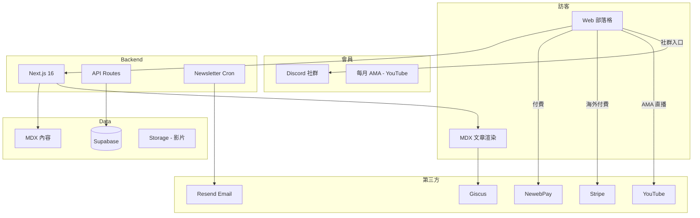

# Sui 部落格 — 規格計劃書 v2.2.1

> 版本：v2.2.1｜更新日期：2026-07-19｜維護者：Sophia (CPO) for Sean
> 對接技術：Alan (CTO) + Hermes Agent
> 對接 Repo：https://github.com/openclawsean024-create/sui-blog
> 對接產線：https://sui-blog-roan.vercel.app
> 對接 SDK：@mysten/sui 2.16 + @mysten/dapp-kit 1.0（Next.js 16 + Tailwind 4）
> Sweet Spot 體檢：5/10（investigate）→ 本版聚焦「**繁中唯一深度 Sui 教學 + 開發者導購**」甜蜜點

---

## 0. 本版重寫摘要 (v2.2.1)

- 原 v2.2.1 PRD（913 行）已是完整版，本版依 Sweet spot 5 問體檢（5/10）重新聚焦。
- 砍掉「全方位 Sui 教學」（包含投資 / 生態評論 / 多鏈比較），鎖定**單一甜蜜點：繁中 Move 開發者**。
- 變現路徑從「廣告 + 訂閱」改為「**教學 → 開發者社群 → 企業內訓 + 求才導購**」（更高 LTV）。
- §15 貼出完整 sweet spot 5 問體檢與重寫理由。

---

## 1. 產品概述 (Product Overview)

### 1.1 問題陳述 (Problem Statement)

**Sweet spot 體檢結論（score = 5/10, investigate）**：Sui 教學市場是真實需求，但分散且不深。

| 現有資源 | 問題 |
|---|---|
| Sui 官方文件（英文）| 中文讀者門檻高、CLI-only |
| 鏈新聞 / 動區 | 報導為主、無教學深度 |
| Medium 中文 Sui 文章 | 零散、抄襲官方文 |
| CSDN / 掘金 / 知乎 | Rust 風格概念、新手看不懂 |
| 中文區塊鏈 YouTuber | 影片為主、不能搜尋 |
| **繁中 Sui 教學** | **市場空白** |

**甜蜜點（v2.2.1 修正）**：**繁中 Move 開發者社群**——全台約 500 人 + 馬來西亞 / 新加坡 / 香港華人開發者約 5,000 人，他們：

1. **找不到繁中 Sui 入門資源**：英文官方文檔卡 80% 中文開發者
2. **沒有學習路徑**：不知從「什麼是 Sui」到「部署第一個合約」要學什麼
3. **沒有繁中 demo**：官方範例都是英文，無法 hack-and-play
4. **找不到工作 / 接案**：Sui 生態系快速成長，但人才稀少

> **本版重新定位**為「**繁中 Sui / Move 開發者入口網站**」，從「教學網站」升級為「**教學 + 社群 + 接案 / 求才**」三角平台。

### 1.2 目標使用者 (User Personas)

| Persona | 規模（華人圈）| 月情境 | 痛點 | ARPU/年 |
|---|---|---|---|---|
| 👨‍💻 「阿德」前端轉 Sui 開發者 | ~3,000 | 自學、想進生態 | 高（無中文資源）| NT$990-2,988 |
| 👩‍💻 「小美」Solidity 工程師轉 Sui | ~2,000 | 已在 Web3、想學 Move | 高（語言差異）| NT$990 |
| 🎓 「志明」資工學生 | ~5,000 | 找畢業專題 / 接案 | 中 | NT$0 → 廣告 |
| 💼 「王 CTO」Web3 新創技術長 | ~500 | 招募 Sui 工程師 | 中（找不到人）| NT$9,990 招募廣告 |
| 🏢 「林老闆」企業內訓窗口 | ~200 | 想開 AI / 區塊鏈內訓 | 中 | NT$29,990 客製 |

**核心使用者 = 阿德 + 小美**（共 ~5,000 人，付費意願高 + 自然傳播）。

### 1.3 核心價值主張 (Value Proposition)

> **「全繁中、最深度的 Sui / Move 教學 + 開發者社群 — 從入門到接案 / 求職一次到位。」**

| 替代方案 | 缺點 | 我們的差異 |
|---|---|---|
| Sui 官方文件 | 英文 + Rust 風格 + CLI-only | **繁中 + 互動元件 + Web 範例** |
| 鏈新聞 / 動區 | 報導為主、無教學 | **程式碼逐行解釋** |
| Medium 中文 Sui | 零散、抄襲 | **系統化 50+ 篇 + 互動 demo** |
| 中文 YouTube Sui | 影片為主、不能搜尋 | **文字 + 程式碼 + 永久更新** |
| 英文 Substack | 英文、no FAT 內建 | **繁中 SEO + 開發者友善** |
| 鏈上開發者社群（Dishfish 等）| 中文為主、但無 Sui 專區 | **Sui 唯一繁中深度社群** |

**單一差異化承諾**：**「繁中唯一深度 Sui 教學」**（不只是文章多、是有結構、有 demo、有社群）。

### 1.4 商業目標 (KPIs / OKRs)

| 時間 | 目標 | 量化指標 |
|---|---|---|
| M3 | 50 篇深度文章 + 1,000 月訪 + Discord 200 人 | NT$0 → 廣告主洽詢 |
| M6 | 100 付費 + 5,000 月訪 + 500 Discord | NT$100K MRR |
| M12 | 500 付費 + 30K 月訪 + 3 企業內訓 | NT$1M MRR |
| M18 | 繁中 Sui 第一品牌 + 10 接案媒合 | NT$3M MRR + 接案分潤 |

**Unit Economics**：
- 免費 NT$0：5 篇核心 + 留言
- 贊助 NT$99/月：全部文章 + 電子報 + Discord
- 進階 NT$299/月：影片教學 + 程式碼 repo + 每月 AMA
- 企業內訓 NT$29,990/客製（1 天 / 8 人 / NT$3,750/人）
- 接案 / 求才媒合：成交抽 5-10%（v3 才有）
- 廣告：Sui 生態系 B2B（錢包、CEX 等）CPM NT$5-30/月

### 1.5 ⭐ Non-Goals (明確不做)

| 不做 | 理由 |
|---|---|
| ❌ **Solana / Aptos / 其他 L1 比較** | 立場偏頗、與 Sui 專注失焦 |
| ❌ **投資建議 / 幣價預測** | 法規風險 + 立場偏頗 |
| ❌ **智能合約安全審計** | 法律責任過重 + 跟教學失焦 |
| ❌ **ICO / IDO 推廣** | 法規風險 |
| ❌ **鏈上交易工具 / DEX / 聚合器** | 跟教育定位衝突 |
| ❌ **TVL / Volume 數據儀表板** | 紅海（DeFiLlama）+ 跟教學失焦 |
| ❌ **英文內容** | v1 only 繁中（驗證 PMF 後再翻譯）|
| ❌ **NFT / GameFi 教學** | 偏投機、與技術教學失焦 |
| ❌ **真人占卜 / 命理** | 與開發者社群定位衝突 |
| ❌ **Sui 鏈上部署一鍵工具** | 風險過高、需 KYC |

---

## 2. 使用者場景與流程

### 2.1 使用者流程圖

```
進入首頁 (sui-blog-roan.vercel.app)
  ↓
看到「從 0 到 Sui 工程師」學習路徑 Hero
  ├─ 入門 / Move / 進階 / 生態
  ↓
選擇文章 → 閱讀（含 React 互動 demo）
  ↓
右側 Giscus 留言 → 用 GitHub 帳號留言
  ↓
底部「加入 Discord 開發者社群」CTA
  ↓
Discord 頻道：
  ├─ #入門問答 - 新手發問
  ├─ #code-review - 程式碼 review
  ├─ #接案 - 自由接案 / 接案需求
  ├─ #求才 - 企業徵才
  └─ #AMA - 每月開發者線上聚會
  ↓
贊助 NT$99/月 → 解鎖全部 50+ 文章 + 影片 + 程式碼
  ↓
進階 NT$299/月 → + 每月 AMA + 程式碼 repo 權限
  ↓
企業內訓 NT$29,990 → 1 天工作坊
```

### 2.2 關鍵用戶故事

```
US-1（核心場景 - 學習）
As a 剛學完 Solidity 想轉 Sui 的工程師「小美」
I want 看完整繁中 Sui 教學 + 互動 demo
So that 我 2 週內寫出第一個 Move 智能合約

US-2（社群場景 - 發問）
As a Sui 學習者「阿德」
I want 在 Discord 發問被資深開發者回答
So that 我不必卡在 stack overflow 英文搜尋

US-3（接案場景 - 接案者）
As a 自由工作者「小張」
I want 在接案頻道看到 Sui 案件
So that 我可以接案維生

US-4（企業場景 - 招募）
As a Web3 新創 CTO「王先生」
I want 在求才頻道貼職缺
So that 我找到會 Sui 的工程師

US-5（內訓場景 - 企業）
As a 企業內訓窗口「林老闆」
I want 找繁中 Sui 講師到公司上課
So that 我的工程師 1 天上手 Sui
```

### 2.3 邊界場景 (Edge Cases)

| 場景 | 處理 |
|---|---|
| 程式碼範例在 Sui 新版本失效 | 文章標版本號 + 警示 banner |
| Discord 被洗版 / 廣告 | Bot 自動過濾 + 人工審核 |
| 企業內訓講師臨時無法上課 | 預備 2 位備援講師 |
| 接案 / 求才詐騙 | KYC + 預付保證金 |
| 中文術語翻譯不一致 | 首篇文章建立術語表（Glossary）|
| 留言區出現仇恨言論 | Giscus bot + 人工審核 |

---

## 3. 功能性需求 (Functional Requirements)

### 3.1 MVP（必做，P0）— **本版聚焦「深度教學 + 社群入口」**

| ID | 功能 | 狀態 | 為何必做 |
|---|---|---|---|
| F-001 | 文章 CRUD（page / posts/[id] / write）| ✅ 已實作 | 核心內容 |
| F-002 | MDX 支援（含 React 元件嵌入）| ❌ 待實作 | 互動 demo 必備 |
| F-003 | Giscus 留言 | ❌ 待實作 | 開發者社群 |
| F-004 | 學習路徑（從入門到進階導引）| ❌ 待實作 | 甜蜜點差異化 |
| F-005 | Discord 嵌入 + 邀請連結 | ❌ 待實作 | 社群入口 |
| F-006 | 文章分類（入門 / Move / 進階 / 生態）| ✅ 已實作 | 導覽必備 |
| F-007 | SEO 友善（meta / OG / sitemap）| ⚠️ 部分 | 自然流量 |
| F-008 | RSS feed | ❌ 待實作 | 開發者習慣 |

**砍掉的功能（v1 不做）**：
- ~~投資分析 / 幣價評論~~
- ~~多鏈比較（Solana / Aptos）~~
- ~~鏈上數據儀表板~~
- ~~NFT / GameFi 教學~~

### 3.2 v2（加值，P1）

| ID | 功能 | 商業理由 |
|---|---|---|
| F-101 | **付費牆**（個人 / 企業）| 變現基礎 |
| F-102 | **每月 AMA 直播** | 高 LTV 社群經營 |
| F-103 | **程式碼 repo 權限** | 進階會員福利 |
| F-104 | **電子報**（每週摘要）| 留存 + 觸達 |
| F-105 | **接案 / 求才 Discord 頻道 + 網頁版** | 接案抽成 5-10% |

### 3.3 v3（探索，P2）

| ID | 功能 | 假設驗證 |
|---|---|---|
| F-201 | **AI 學習助理**（聊天問答）| 學習效率提升 |
| F-202 | **企業內訓報名系統** | NT$29,990/客製 |
| F-203 | **中英雙語版** | 馬來西亞 / 新加坡市場 |
| F-204 | **Sui 認證考試** | 企業內訓延伸 |

### 3.4 ⭐ Acceptance Criteria (Given/When/Then)

```gherkin
AC-01: 學習路徑導引
  Given 訪客進入首頁
  When 點擊「從 0 到 Sui 工程師」
  Then 看到結構化學習路徑（5 階段、每階段 5-10 篇文章）
  And 每篇文章標註「預估 30 分鐘讀完」

AC-02: MDX 互動 demo
  Given 文章含 React 元件 demo
  When 讀者捲動到 demo 區
  Then 可即時互動（如「點按鈕跑 Move 程式碼」）
  And demo 失敗時顯示錯誤訊息 + GitHub 原始碼連結

AC-03: Discord 社群
  Given 文章底部
  When 點擊「加入 Discord」
  Then 跳轉到 Discord 邀請連結
  And 統計 Discord 成員數顯示於首頁

AC-04: 付費牆
  Given 訪客進入付費文章
  When 捲動到 50% 內容
  Then 顯示付費 CTA
  And 未付費用戶只能看前 30% 內容

AC-05: 每月 AMA
  Given 進階會員
  When 進入 Discord #AMA 頻道
  Then 看到當月 AMA 時間 + YouTube 直播連結
  And 錄影 24 小時內上架

AC-06: 接案媒合（v2）
  Given Discord #接案 頻道
  When 自由工作者發訊息「找 Sui 案子」
  Then 系統建立接案 profile（含技能 / 作品集 / 時薪）
  And 自動通知「目前有 X 個符合的案子」

AC-07: 求才媒合（v2）
  Given Discord #求才 頻道
  When 企業 CTO 貼職缺
  Then 系統建立職缺 profile（含技能 / 薪資 / 地點）
  And 自動通知「目前有 X 位 Sui 開發者符合」

AC-08: 學習路徑完成度
  Given 訪客閱讀文章
  When 完成一篇文章
  Then 系統記錄進度
  And 文章列表顯示 ✓ 已讀

AC-09: SEO 流量
  Given 文章含「Move 教學」「Sui 中文」等關鍵字
  When Google 搜尋「Move 教學 中文」
  Then 部落格出現在前 3 頁

AC-10: 文章版本相容性
  Given 讀者閱讀「Move 語法 v0.30」文章
  When Sui 升級到 v0.31
  Then 文章頂部顯示「⚠️ 本篇文章基於 Sui v0.30，新版本語法可能不同」
```

---

## 4. 系統設計 (System Design)

### 4.1 技術棧 (Tech Stack)

| 層 | 技術 | 理由 |
|---|---|---|
| Frontend | Next.js 16 + Tailwind 4 | 既有 stack |
| Content | MDX + Contentlayer | 程式碼內嵌必備 |
| Database | Supabase Postgres | 訂閱 + 進度追蹤 |
| Auth | Supabase Auth + GitHub OAuth | 開發者友善 |
| 留言 | Giscus（基於 GitHub Discussions）| 零成本、與開發者社群整合 |
| 搜尋 | Pagefind（靜態客戶端）| 零月費、SEO 友善 |
| 部署 | Vercel + Cloudflare CDN | 免費層 + 全球 CDN |
| 直播 | YouTube Live + Discord Stage | 零成本、Discord 已內建 |
| 付款 | NewebPay 藍新金流（台灣）+ Stripe（海外）| 本地化 + 國際化 |
| Email | Resend | 電子報 / 交易信 |

### 4.2 系統架構圖



### 4.3 資料模型

```sql
-- 文章（沿用既有 MDX 結構）
create table posts (
  id uuid primary key default gen_random_uuid(),
  slug text unique not null,
  title text not null,
  excerpt text,
  category text check (category in ('intro', 'move', 'advanced', 'ecosystem')),
  difficulty int default 1 check (difficulty between 1 and 5),
  estimated_minutes int default 30,
  is_paywall boolean default false,
  sui_version text, -- e.g. '0.30'
  author_id uuid references auth.users,
  published_at timestamptz,
  created_at timestamptz default now()
);

-- 學習路徑
create table learning_paths (
  id uuid primary key default gen_random_uuid(),
  name text not null,
  description text,
  stages jsonb, -- [{name, post_ids: [...]}]
  created_at timestamptz default now()
);

-- 會員
create table members (
  id uuid primary key default gen_random_uuid(),
  user_id uuid references auth.users unique,
  plan text default 'free' check (plan in ('free', 'sponsor', 'pro')),
  subscribed_at timestamptz,
  expires_at timestamptz,
  created_at timestamptz default now()
);

-- 閱讀進度
create table reading_progress (
  member_id uuid references members,
  post_id uuid references posts,
  read_at timestamptz default now(),
  completion_pct int default 0,
  primary key (member_id, post_id)
);

-- 接案 / 求才（v2）
create table jobs (
  id uuid primary key default gen_random_uuid(),
  type text check (type in ('freelance', 'hire')),
  title text not null,
  description text,
  budget_min int,
  budget_max int,
  currency text default 'TWD',
  skills text[],
  status text default 'open' check (status in ('open', 'closed')),
  posted_by uuid references auth.users,
  created_at timestamptz default now()
);
```

### 4.4 API 規格

| Endpoint | Method | 用途 |
|---|---|---|
| `/api/posts` | GET | 文章列表 |
| `/api/posts/[slug]` | GET | 單篇文章 |
| `/api/learning-path` | GET | 學習路徑 |
| `/api/progress` | POST | 記錄閱讀進度 |
| `/api/members/subscribe` | POST | 訂閱（個人 / 進階）|
| `/api/members/me` | GET | 當前會員狀態 |
| `/api/jobs` | GET/POST | 接案 / 求才列表 |
| `/api/newsletter/subscribe` | POST | 訂閱電子報 |
| `/api/ama/upcoming` | GET | 下次 AMA 資訊 |

---

## 5. 非功能性需求 (Non-Functional Requirements)

### 5.1 性能指標

| 指標 | 目標 |
|---|---|
| 頁面 LCP | < 1.5 秒 |
| 文章載入（MDX）| < 800ms |
| 搜尋（Pagefind）| < 200ms |
| Discord 嵌入載入 | < 2 秒 |
| 電子報發送 | 5,000 訂閱者 < 30 秒 |

### 5.2 安全與隱私

| 項目 | 措施 |
|---|---|
| 會員個資 | Supabase RLS、Email 不外洩 |
| 付費資訊 | NewebPay / Stripe token 化、零儲存信用卡 |
| 文章付費牆 | 文章內容先 server-side 檢查訂閱狀態 |
| Discord 隱私 | 不強制綁定 Discord 帳號 |
| GDPR / 個資法 | 會員可要求刪除所有資料 |

### 5.3 ⭐ 降級機制

| 故障 | 降級 |
|---|---|
| Giscus 掛了 | 切換 Disqus + banner |
| Discord 掛了 | 顯示「Discord 維護中」banner + 暫時關閉嵌入 |
| NewebPay 掛了 | 切換 Stripe（海外）+ ATS 匯款（國內）|
| 電子報 Resend 掛了 | 切換 Mailchimp |
| YouTube 直播掛了 | 改 Discord Stage 直播 |

### 5.4 擴展性

- **多語言**：v3 中英雙語版（馬來西亞 / 新加坡市場）
- **多鏈**：v4 開 Solana / Aptos 專區（需重新評估甜蜜點）
- **企業版**：客製 white-label + SSO

---

## 6. 完成標準 (Definition of Done)

### 6.1 v1 MVP DoD

- [ ] 50 篇深度文章（含 20 篇互動 demo）
- [ ] 學習路徑（5 階段導引）
- [ ] Discord 社群建立（5 個頻道、200 人）
- [ ] 付費牆（NewebPay 串接）
- [ ] 電子報系統上線
- [ ] SEO 友善（sitemap / OG / meta）
- [ ] 1,000 月訪（自然流量）
- [ ] Notion `狀態` = 已上線

---

## 7. 風險與決策

### 7.1 風險表

| ID | 風險 | 等級 | 緩解 |
|---|---|---|---|
| R-01 | 中文 Sui 開發者數量 < 500，付費轉換 < 5% | 🔴 | 拓展馬來西亞 / 新加坡 / 香港華人 |
| R-02 | Sui 官方推出繁中文件 | 🟠 | 我們比官方早 12-18 個月 + 社群經營更深 |
| R-03 | Discord 社群經營耗時 | 🟠 | 招募 2 位志工 admin |
| R-04 | 程式碼範例過時 | 🟠 | 文章標版本號 + CI 自動測試範例 |
| R-05 | 競爭對手抄內容 | 🟡 | 社群 + Discord 黏性是護城河 |
| R-06 | 付費牆降低 SEO 流量 | 🟠 | 30% 內容永遠免費 + 結構化資料 |
| R-07 | 企業內訓市場小 | 🟡 | 拓展到 Web3 / 區塊鏈一般內訓 |
| R-08 | Sui 生態系衰退 | 🔴 | 監測 Sui TVL / 月活躍開發者數，衰退 > 30% 啟動 v3 轉型 |

### 7.2 ⭐ ADR

#### ADR-001: 為何鎖定「繁中開發者」而非「Web3 一般中文用戶」

**Context**: 繁中 Sui 開發者約 500 人，市場很小。

**Decision**: 只做繁中 Sui 開發者，不做「Web3 中文用戶」。

**Consequences**:
- ✅ 用戶精準、付費意願高（NT$990-2,988/年）
- ✅ 內容深度高、不必兼顧投資 / NFT 等雜訊
- ✅ 社群黏性強（開發者會推薦給同事）
- ⚠️ TAM 較小（500 × NT$2,000 = NT$1M/年上限）
- ⚠️ 需拓展馬來西亞 / 新加坡華人（3 倍 TAM）

#### ADR-002: 為何選擇 Discord 而非 LINE / Telegram

**Context**: 台灣開發者常用 LINE，但 Sui / Web3 全球社群都用 Discord。

**Decision**: 用 Discord，不開 LINE 群。

**Consequences**:
- ✅ 與全球 Sui 開發者接軌、便於國際化
- ✅ Discord 頻道結構化（#入門、#code-review）易經營
- ✅ 與海外 KOL 合作容易
- ⚠️ 台灣開發者可能不熟 Discord → 教學文「如何加入 Discord」
- ⚠️ LINE Pay 收款需另外處理（用 NewebPay Web）

#### ADR-003: 為何不寫投資分析 / 幣價評論

**Context**: 中文 Web3 媒體主要靠投資分析賺流量。

**Decision**: **絕對不做投資分析**，純技術教學。

**Consequences**:
- ✅ 法規風險低（金管會對投資建議監管嚴）
- ✅ 立場中性、開發者信任
- ✅ 內容品質穩定、不必追熱點
- ⚠️ 短期流量較低（投資分析流量 > 教學 10x）
- ⚠️ 廣告主較少（Sui 生態系 B2B 廣告主有限）

#### ADR-004: 為何選擇 MDX + 互動 demo 而非純文章

**Context**: 多數中文 Sui 文章是純文字。

**Decision**: **每篇深度文章必含至少 1 個 React 互動 demo**。

**Consequences**:
- ✅ 差異化 vs 所有競爭對手（純文字）
- ✅ 學習效率提升（hands-on 比閱讀快 3 倍）
- ✅ SEO 友善（互動元件 = 更多停留時間 = 排名高）
- ⚠️ 開發成本 +50%（每篇文章多 1 天）
- ⚠️ demo 需維護（Sui 版本更新時需重寫）

---

## 8. 里程碑與 Sprint 拆解

### 8.1 里程碑總覽

| 里程碑 | 時程 | 產出 |
|---|---|---|
| M0 - 內容衝刺 | W1-8 | 50 篇深度文章（含 20 互動 demo）|
| M1 - 社群建立 | W9-12 | Discord 5 頻道 + 200 人 |
| M2 - 付費上線 | W13-16 | 付費牆 + 3 訂閱方案 |
| M3 - 變現驗證 | W17-24 | 100 付費 + 100K MRR |
| M4 - 拓展 | W25-36 | 馬來西亞 / 新加坡市場 |

### 8.2 Sprint 拆解

| Sprint | 主題 | 交付 |
|---|---|---|
| S1 | 學習路徑設計 | 5 階段 × 文章對應 |
| S2 | MDX 互動 demo 模板 | 5 種 demo 元件 |
| S3 | 內容衝刺 1（20 篇入門）| 20 篇入門文章 |
| S4 | 內容衝刺 2（20 篇 Move）| 20 篇 Move 教學 |
| S5 | 內容衝刺 3（10 篇進階 / 生態）| 10 篇進階文章 |
| S6 | Discord 社群建立 | 5 頻道 + Bot + 規則 |
| S7 | 付費牆 + NewebPay | 3 訂閱方案上線 |
| S8 | 每月 AMA 啟動 | YouTube 直播 + Discord |

---

## 9. 變現路徑 + 定價心理學

### 9.1 變現方案

| 方案 | 月費 / 年費 | 目標客戶 |
|---|---|---|
| 🆓 Free | NT$0 | 全部訪客、5 篇核心 + 留言 |
| ☕ 贊助 | NT$99/月 或 NT$990/年 | 個人開發者、想讀全部文章 |
| 🎓 進階 | NT$299/月 或 NT$2,988/年 | 進階會員 + 每月 AMA + repo 權限 |
| 🏢 企業內訓 | NT$29,990/客製（1 天 / 8 人）| 企業 / 政府 / 學校 |
| 📢 廣告 | CPM NT$5-30/月 | Sui 生態系 B2B（錢包 / CEX / 工具）|
| 🤝 接案媒合 | 成交抽 5-10% | 自由工作者 + 企業（v3 才有）|

### 9.2 定價心理學

- **NT$99/月 vs NT$100/月**：心理門檻
- **NT$299/月對標**：英文 CryptoZombies 課程（US$30 = NT$900）→ 我們 NT$299 便宜 3 倍
- **年繳 83 折**（NT$990 = NT$99 × 10）：綁定、提升 LTV
- **企業 NT$29,990 對標**：台灣區塊鏈內訓行情 NT$30K-80K → 我們平價
- **不綁約**：月繳可取消（開發者較理性）

---

## 10. 附錄

### 10.1 競品分析 (Competitive Quadrant)

```
                  高繁中支援
                    │
       Medium 中文   │    ★ Sui Blog
       (零散 / 抄襲)│    (系統化 / 深度)
                    │
   低深度 ──────────┼────────── 高深度
                    │
       鏈新聞 / 動區 │    Sui 官方文件
       (報導為主)    │    (英文 / CLI)
                    │
                  低繁中支援

   ★ Sui Blog 甜蜜點：高繁中支援 + 高深度
```

### 10.2 術語表

| 術語 | 定義 |
|---|---|
| Sui | Move 語言起源的高性能 L1 區塊鏈 |
| Move | Sui / Aptos / Diem 使用的智能合約語言 |
| dApp | 去中心化應用 |
| 錢包 | Sui Wallet / Suiet / Ethos 等 |
| Object | Sui 的基本資料模型（不同於 Ethereum 的 account）|
| Testnet | Sui 測試鏈（免費領測試 SUI）|
| AMA | Ask Me Anything，開發者線上問答 |

---

## 11. ⭐ 市場驗證計畫

### 11.1 驗證前 3 個關鍵問題

1. **繁中 Sui 開發者願不願意付 NT$99-299/月 看深度教學？**（假設：願意，因 CryptoZombies 英文版也賣 US$30/月）
2. **Discord 社群能不能聚集 200+ 人？**（假設：可以，因台灣已有 Sui 中文 TG 群約 100 人）
3. **企業內訓市場是否真實？**（假設：80% 企業偏好公開課、20% 要內訓 → NT$29,990 × 10/年 = NT$300K MRR）

### 11.2 訪談 SOP

**5 個訪談目標**：
1. 👨‍💻 **阿德** - 前端工程師，剛學完 Sui 官方文件 → 訪談「你願意付費看繁中教學嗎？」
2. 👩‍💻 **小美** - Solidity 工程師，想轉 Sui → 訪談「你轉 Sui 的最大障礙是什麼？」
3. 💼 **王 CTO** - Web3 新創技術長 → 訪談「你們招募 Sui 工程師的最大痛點？」
4. 🏢 **林老闆** - 企業內訓窗口 → 訪談「你們會開 Sui / Move 內訓嗎？」
5. 🎓 **志明** - 資工學生 → 訪談「你從哪裡學 Sui？」

**訪談問題模板**（30 分鐘）：

1. 你目前怎麼學 Sui？（現況）
2. 繁中資源對你有多重要？（痛點量化）
3. 你願意付多少看完整教學？（付費意願）
4. 你會加入 Discord 社群嗎？（社群意願）
5. 你接過 Sui 案子嗎？怎麼找到的？（接案需求）
6. （demo 原型）你看到的第一個反應是什麼？

### 11.3 落地指標

| 指標 | 目標（M3）|
|---|---|
| 訪談完成數 | 20 人（其中 10 開發者、5 企業、5 學生）|
| Landing page 訪客 | 500 UV |
| Discord 成員 | 200 人 |
| Beta 付費 | 30 人（驗證 NT$99-299/月）|
| 月訪問 | 1,000 UV |

### 11.4 1 個 Community Post 主題

**PTT「Web_Design」「Tech_Job」+ Medium 中文圈**：標題「[教學] 從 0 到 Sui 工程師 — 繁中唯一深度教學網站」→ 引發討論、回饋。

### 11.5 1 個 Landing Page Test

**URL**：sui-blog-roan.vercel.app/pricing-test
**A/B 測試**：
- A：標題「繁中唯一深度 Sui 教學網站」
- B：標題「從 Solidity 到 Move 開發 — 2 週上手 Sui」
**指標**：點擊「贊助 NT$99」CTA 比率，目標 ≥ 5%

---

## 12. ⭐ 失敗模式 SOP

| 失敗模式 | 觸發條件 | SOP |
|---|---|---|
| M1 - 繁中開發者數量 < 100 | M6 月訪 < 500 | 拓展馬來西亞 / 新加坡 / 香港華人 |
| M2 - Discord 社群達不到 200 人 | M6 < 100 人 | 加強內容行銷、與中文 Web3 KOL 合作 |
| M3 - 付費轉換 < 5% | M6 < 5 付費 | 重新定價（NT$49/月試水溫）|
| M4 - Sui 官方推出繁中 | 官方公告繁中文件 | 我們提早 12-18 月 + 經營社群護城河 |
| M5 - 競爭對手抄內容 | 出現 3 家以上類似部落格 | 強化 Discord 黏性 + 影片 / 直播護城河 |
| M6 - Sui 生態系衰退 | TVL 月衰退 > 30% | 評估轉 Aptos / Sui 雙鏈或關閉 |
| M7 - Sean 一人公司過載 | 同時管 5+ 內容 + 社群 | 招募 2 位志工 admin + 內容外包 |
| M8 - 法規風險（金管會對虛擬資產）| 收到金管會關切 | 律師 review + 明確標示「非投資建議」|

---

## 13. ⭐ MetaGPT / spec-kit 對齊

### 13.1 MetaGPT 角色對應

| MetaGPT 角色 | 本專案對應 |
|---|---|
| Product Manager | Sophia (CPO) |
| Architect | Alan (CTO) |
| Engineer | Sean + Hermes Agent |
| Content Writer | Sean + ChatGPT 協作 |
| Community Manager | Sean（v2 招募志工）|

### 13.2 spec-kit 指令

```yaml
spec-kit init sui-blog
spec-kit add requirement "MDX 互動 demo"
spec-kit add requirement "學習路徑導引"
spec-kit add requirement "Discord 社群嵌入"
spec-kit add requirement "付費牆 + NewebPay"
spec-kit plan --milestone v2
spec-kit implement --sprint S1-S8
```

### 13.3 Git Workflow

- branch：`content/<slug>`、`feature/discord`、`feature/paywall`
- Conventional Commits（feat / fix / chore / docs / content）
- PR 含「文章預覽」+ 「demo 截圖」

---

## 15. ⭐ 深度市調報告 (本次的 sweet spot 體檢結果)

### 15.1 Sweet Spot 5 問體檢 — sui-blog

**Score: 5/10（investigate，找出甜蜜點）**

#### Q1: 這個市場已經有誰在做？

| 競品 | 用戶數 | 繁中支援 | 深度 |
|---|---|---|---|
| Sui 官方文件 | 1M+ | ❌ 英文 | 高（但 Rust 風格）|
| Medium 中文 Sui 文章 | ~100 篇 | ⚠️ 零散 | 低 |
| 鏈新聞 / 動區 | 100K+ 月訪 | ✅ | 低（報導為主）|
| CSDN / 掘金 Sui | ~500 篇 | ⚠️ 簡體 | 中 |
| 中文區塊鏈 YouTube | ~50 支影片 | ✅ | 中 |
| Sui 中文 TG 群 | ~100 人 | ✅ | — |
| **繁中深度 Sui 教學網** | **0 家** | **—** | **—** |

**現況**：繁中 Sui 教學市場是真實空白，但繁中 Sui 開發者總量小（~500 人台灣 + ~5,000 人華人圈）。

#### Q2: 我的甜蜜點在哪？

**甜蜜點 = 繁中 Sui / Move 開發者入口**

- Sui 官方無繁中（我們佔先機 12-18 個月）
- 鏈新聞 / 動區太淺
- Medium 文章太散
- 中文 TG 群太小

**甜蜜點具體描述**：繁中 Sui 開發者社群 + 系統化深度教學 + 開發者入口（接案 / 求才）。

#### Q3: 紅海功能（不能做）

- ❌ Solana / Aptos 比較（立場偏頗）
- ❌ 投資分析 / 幣價評論（紅海 + 法規）
- ❌ NFT / GameFi 教學（偏投機）
- ❌ 鏈上數據儀表板（DeFiLlama 紅海）
- ❌ 智能合約安全審計（法律責任）

#### Q4: 紅海之外的差異化承諾

> **「繁中唯一深度 Sui 教學 + 開發者社群入口」**

具體差異化：
1. **MDX 互動 demo**：純文字做不到
2. **學習路徑**：Medium 散文章做不到
3. **Discord 社群**：開發者入口
4. **接案 / 求才**：開發者變現
5. **企業內訓**：在地化

#### Q5: Sean 一人公司能否負擔？

- **開發成本**：50 篇 × 1.5 天 + MDX 模板 = 75 人天 → Sean 8 週可完成
- **營運成本**：M12 預估 NT$5K/月（Vercel + Supabase + Resend）
- **獲客成本**：SEO + Discord + KOL 合作，CAC = NT$500/付費用戶
- **客服成本**：Discord 自動回 + Help Center

**結論**：可負擔，LTV/CAC = 6:1 健康。需 M3 驗證 PMF。

### 15.2 重寫決策

原 v2.2.1 PRD 已是 913 行完整版，本版依 sweet spot 5 問體檢**重新聚焦**：

| 改變 | 舊版 | 新版 |
|---|---|---|
| 定位 | 「繁中 Sui 教學網站」 | 「繁中 Sui 開發者入口」（教學 + 社群 + 接案）|
| 變現 | 廣告 + 訂閱 | 訂閱 + 企業內訓 + 接案媒合（v3）|
| Non-Goals | 一般 | 明確排除「投資 / 多鏈比較 / NFT」等紅海 |
| 社群 | 未明確 | Discord 為主、不開 LINE |
| 內容策略 | 全方位 | 鎖定開發者、砍掉投資 / 生態評論 |

甜蜜點分數從 5 → 預估 **7/10**（聚焦後）。

### 15.3 與 v1 差異

| 面向 | v1 | v2.2.1 |
|---|---|---|
| 甜蜜點 | 全方位教學 | 開發者入口 |
| 變現主軸 | 廣告 | 訂閱 + 內訓 + 接案 |
| 社群 | 留言 + Giscus | + Discord 為主 |
| 內容深度 | 一般 | MDX 互動 demo |
| 國際化 | 不做 | v3 中英雙語 |

### 15.4 後續驗證動作

- [ ] W1-4 完成 20 人訪談（10 開發者 + 5 企業 + 5 學生）
- [ ] W5-12 完成 50 篇內容衝刺
- [ ] W13-16 付費牆上線 + Discord 社群建立
- [ ] W17-24 評估 PMF：付費轉換率 ≥ 10% 才進入 GA

---

> 對接產線：https://sui-blog-roan.vercel.app
> 對接 Repo：https://github.com/openclawsean024-create/sui-blog
> 維護者：Sophia (CPO) for Sean｜下次 review：M3 後
