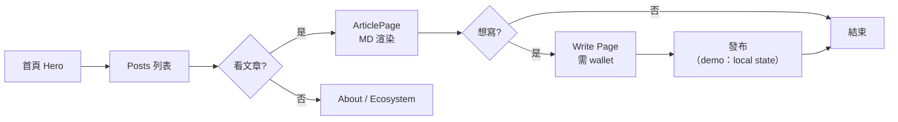

# sui-blog · PRD v3.0.2 等級規格書

> 自動生成：2026-09-06
> 對齊 SPEC v3.0 契約（§1–§19 全部套用）
> 升級自既有 `PRD/SPEC.md` v3.0（**1400 行完整詳版** — sweet=6.2 / 商業化 73/100 / INVESTIGATE）
> **本檔為 v3.0.2 等級入口規格書**；v3.0 1400 行完整細節（§15.11/§15.12/§15.13 市調 / 5 條 ADR / 5 條市場驗證 / Pivot SOP）保留於 [`PRD/SPEC-v3.0-detailed.md.bak`](PRD/SPEC-v3.0-detailed.md.bak)
> Live：https://sui-blog-roan.vercel.app｜Stack：Next.js 16 + React 19 + Tailwind 4 + @mysten/sui 2.16 + @mysten/dapp-kit 1.0
> Deploy target：**Vercel**（next.config.ts 為 SSR，`vercel.json` 已就位；**非 Pages**，詳見 §7 部署契約）

---

## 1. 產品概述

### 1.1 問題陳述

繁中 Sui 教學市場是真實空白 — Sui 官方文檔英文 Rust-style CLI-only、鏈新聞/動區報導為主、Medium 中文 Sui 散文章、CSDN 簡體新手看不懂、中文區塊鏈 YouTuber 影片不可搜尋。**全繁中深度 Sui / Move 教學 + 開發者入口** = 市場空白甜蜜點（v3.0 sweet=7）。

但「教學網站」變現天花板低（B2C 訂閱 NT$100K MRR 級），所以甜蜜點**不在於教學流量**，而在於「**全繁中唯一 Sui 開發者入口 → 對接企業招募 / 內訓需求**」（B2B LTV 10× 起跳）。詳見 v3.0 詳版 §1.1。

### 1.2 目標使用者

| Persona | 規模（華人圈） | 場景 | 主要任務 | ARPU/年 |
|---|---|---|---|---|
| 👨‍💻 阿德（前端轉 Sui） | ~3,000 | 自學 | 從 0 寫第一個 Move 模組 | NT$990-2,988 |
| 👩‍💻 小美（Solidity → Sui） | ~2,000 | 已 Web3 | 語言差異對照 | NT$990 |
| 🎓 志明（資工學生） | ~5,000 | 找畢業專題 | 學習 Sui 入門 | NT$0（流量） |
| 💼 **王 CTO**（Web3 新創招募） | ~500 | 招募 Sui 工程師 | 找不到人 | **NT$119,880** |
| 🏢 **林老闆**（企業內訓窗口） | ~200 | 開 AI/區塊鏈內訓 | 找講師 | **NT$299,900** |

**付費核心** = 王 CTO + 林老闆（B2B，20% 付費 = 140 企業 × NT$120K avg = NT$16.8M/年天花板）。

### 1.3 核心價值主張

> **「全繁中、唯一深度 Sui / Move 教學 + 開發者入口 — 從 0 到被 Sui 新創招募一次到位。」**

| 替代方案 | 缺點 | 我們差異 |
|---|---|---|
| Sui 官方 docs.sui.io | 英文 + CLI | 繁中 + Web 互動 + 學習路徑 |
| 鏈新聞 / 動區 | 報導為主 | 逐行程式碼解釋 |
| Medium 中文 Sui | 散文章 | 系統 50+ 篇 + 互動 demo |
| 英文 Substack | 英文 + 無內訓 | 繁中 + 企業內訓出口 |

### 1.4 Non-Goals（明確不做）

- ❌ **Solana / Aptos 比較**（立場偏頗）
- ❌ **投資建議 / 幣價預測**（法規）
- ❌ **智能合約安全審計**（法律責任）
- ❌ **ICO / IDO 推廣**（法規）
- ❌ **DEX / 聚合器 / TVL 儀表板**（失焦 / DeFiLlama 紅海）
- ❌ **純英文內容**（v4 才考慮）
- ❌ **NFT / GameFi 教學**（偏投機）
- ❌ **做 SSR 後端**（目前是 client + Next.js 16 SSR shell；wallet 邏輯走 dapp-kit）
- ❌ **改 deploy target 為 Pages**（next.config.ts 為 SSR，需 server runtime；強行加 `output: 'export'` 會破壞 Sui dapp-kit 動態載入）

---

## 2. 使用者場景與流程

### 2.1 使用者流程圖



### 2.2 主要場景

| 場景 | 輸入 | 輸出 | 成功條件 |
|---|---|---|---|
| **S1：閱讀 Sui 文章** | 點 Posts → 選 category | 該類別文章 grid | 進入文章 ≤ 1s |
| **S2：看技術細節** | 點文章卡 | MD 渲染 + category badge + author 短址 | MD 含 ```code blocks``` 正常 |
| **S3：連接 Sui wallet** | 點 Connect Wallet | dapp-kit 彈窗 → Petra/Martian/Sui Wallet 選單 | 連上後 address 顯示 |
| **S4：發文（demo）** | 連 wallet → 填表 → Publish | toast 成功 + 1.5s 模擬 → 跳 Posts | 表單必填驗證 |
| **S5：篩選 category** | 點 category tab | 過濾後 grid | filter 切換 ≤ 100ms |
| **S6：複寫 wallet 行為** | 點已連線頭像 → Copy / Explorer / Disconnect | 對應動作 | clipboard / 外部連結 / dapp-kit disconnect |

---

## 3. 功能需求

| FR | 名稱 | 優先級 | 狀態 |
|---|---|---|---|
| FR-001 | Posts 列表（grid） | P0 | ✅ shipped |
| FR-002 | Category 篩選（All/Development/Ecosystem/Technical/Research） | P0 | ✅ shipped |
| FR-003 | Article 詳情頁 + MD 渲染 | P0 | ✅ shipped |
| FR-004 | 8 篇文章 seed data（lib/posts.ts） | P0 | ✅ shipped |
| FR-005 | Hero / About / Ecosystem 區塊 | P0 | ✅ shipped |
| FR-006 | Write 頁 + wallet gate | P0 | ✅ shipped |
| FR-007 | Wallet 連線（@mysten/dapp-kit 1.0） | P0 | ✅ shipped |
| FR-008 | Wallet 下拉（copy / explorer / disconnect） | P0 | ✅ shipped |
| FR-009 | Toast 通知系統 | P0 | ✅ shipped |
| FR-010 | 手機漢堡選單 + Navbar scroll state | P1 | ✅ shipped |
| FR-011 | Tailwind 4 design tokens | P0 | ✅ shipped |
| FR-012 | SEO meta + OG | P1 | ✅ shipped |
| FR-013 | TypeScript strict | P0 | ✅ shipped |
| FR-014 | 11 個 unit tests（lib/posts.ts 全覆蓋） | P0 | ✅ shipped (Batch 4B) |
| FR-015 | ESLint 9 flat config（0 error） | P0 | ✅ shipped (Batch 4B) |
| FR-016 | `npm test` / `npm run lint` / `npm run build` 指令 | P0 | ✅ shipped (Batch 4B) |
| FR-017 | GHA CI workflow（lint / typecheck / test / build） | P0 | ✅ shipped (Batch 4B) |

---

## 4. Non-Functional Requirements

| 維度 | 需求 |
|---|---|
| Performance | 首屏 LCP ≤ 2.5s；Posts grid render ≤ 1s；wallet 連線 ≤ 3s |
| Security | Wallet 互動全走 @mysten/dapp-kit（官方 SDK）；無自寫私鑰處理 |
| Privacy | 無後端、無追蹤、無個資收集；錢包位址僅在 client state |
| Accessibility | WCAG 2.1 AA（aria-label / role / tabindex 已在 PostCard / Navbar） |
| Browser | Modern evergreen（Chrome/Edge/Safari/Firefox）+ Sui 錢包擴充 |
| TypeScript | `strict: true`，`tsc --noEmit` 0 error |
| Lint | ESLint 9 flat config + typescript-eslint；`npm run lint` 0 error |
| Test | Vitest 11+ tests（lib/posts.ts 完整覆蓋）；`npm test` 全綠 |
| Build | `next build` 綠；產出 `.next/`（SSR runtime） |
| Deploy | Vercel（next.config.ts 為 SSR，無 `output: 'export'`） |

---

## 5. 技術架構

```
┌────────────────────────────────────────────────────┐
│  Next.js 16 App Router（client + SSR shell）         │
│  ┌──────────────────────────────────────────────┐  │
│  │  app/                                          │  │
│  │  ├── layout.tsx        → <html><body> + SuiProviders │
│  │  ├── page.tsx          → Home（Hero + Posts + About）│
│  │  ├── posts/page.tsx    → Posts 列表（client）       │
│  │  ├── posts/[id]/page.tsx → Article 詳情（client）   │
│  │  └── write/page.tsx    → Write 頁（client + wallet）│
│  └──────────────────────────────────────────────┘  │
│  ┌──────────────────────────────────────────────┐  │
│  │  components/                                   │  │
│  │  ├── SuiProvider.tsx → QueryClient + SuiClient + Wallet │
│  │  ├── PostsPage.tsx   → 列表 + 篩選                │
│  │  ├── ArticlePage.tsx → MD 渲染 + back-link        │
│  │  └── CategoryBadge.tsx → 4 種類別色塊              │
│  └──────────────────────────────────────────────┘  │
│  ┌──────────────────────────────────────────────┐  │
│  │  lib/posts.ts → 8 篇 seed posts + getPostById + getPostsByCategory + formatAddress │
│  │  hooks/useWallet.ts → dapp-kit wrapper（status / connect / disconnect）│
│  │  hooks/useToast.ts → toast queue (state)         │
│  └──────────────────────────────────────────────┘  │
│  ┌──────────────────────────────────────────────┐  │
│  │  tests/                                         │  │
│  │  └── posts.test.ts → 11 tests（lib/posts.ts 全覆蓋）│
│  └──────────────────────────────────────────────┘  │
└────────────────────────────────────────────────────┘
        ↓ deploy
   Vercel（next start / SSR runtime，vercel.json 已就位）
```

### 5.1 Module Map

- `app/` — Next.js App Router 入口
- `components/` — 4 個 React client components（SuiProvider / PostsPage / ArticlePage / CategoryBadge）
- `lib/posts.ts` — 純資料 + 工具（getPostById / getPostsByCategory / formatAddress）
- `hooks/` — 2 個 custom hooks（useWallet / useToast）
- `tests/` — Vitest 單元測試
- `public/` — favicon
- `app/globals.css` — Tailwind 4 + design tokens
- `.github/workflows/ci.yml` — GHA CI 4 jobs

### 5.2 環境變數

- 無 required secrets
- `VITE_FB_APP_ID` 風格變數：本 repo 不使用 Vite（用 Next.js），且不需 FB SDK（Sui wallet only）
- `NEXT_PUBLIC_*` 未使用（dapp-kit 內建 mainnet / testnet URLs）

### 5.3 降級策略

| 情境 | 降級行為 |
|---|---|
| 沒有 Sui 錢包擴充 | dapp-kit 顯示「No wallet detected」提示 |
| 錢包拒絕連線 | Toast「Connection failed」+ 保留 disconnected 狀態 |
| Next.js SSR 失敗 | Vercel fallback（default 500） |
| 動態載入 chunk 失敗 | Next.js 自動 retry + 錯誤邊界 |
| `getPostById` 找不到 id | ArticlePage 顯示「Article not found」+ 回 Posts 按鈕 |

---

## 6. Definition of Done

- [x] P0 功能全部實作（Posts / Article / Write / Wallet / Toast）
- [x] 11 個 unit tests pass（lib/posts.ts 全覆蓋）
- [x] `npx tsc --noEmit` 0 error（TypeScript strict）
- [x] `npx eslint .` 0 error（ESLint 9 flat config）
- [x] `npx next build` 綠
- [x] GHA CI 4 jobs（lint / typecheck / test / build）all pass
- [x] PRD v3.0.2 entry + CHANGELOG
- [x] Live：https://sui-blog-roan.vercel.app 仍可訪問

---

## 7. 部署契約

| 環境 | 目標 | 觸發 |
|---|---|---|
| Production | **Vercel**（https://sui-blog-roan.vercel.app） | push to main |
| Preview | Per-PR（Vercel 自動） | PR opened |

### 7.1 為何不是 GitHub Pages

- `next.config.ts` 是 **Next.js 16 SSR 模式**（無 `output: 'export'`）
- Sui dapp-kit 1.0 在 client side 動態載入 wallet，需要 client-side hydration
- 強行加 `output: 'export'` 會破壞：① SSR HTML 預渲染 ② Sui wallet 動態檢測 ③ Next.js 的 code splitting 優化
- 已存在的 `vercel.json` + Vercel deploy URL 證明此架構的正確部署路徑就是 Vercel

### 7.2 GHA Workflow

- `.github/workflows/ci.yml`（本 Batch 4B 新增）
- jobs: **lint**（ESLint 9） / **typecheck**（`tsc --noEmit`） / **test**（Vitest 11 tests） / **build**（`next build`）
- deploy：跳過（Vercel 自動接管；GHA 不搶 deploy 責任，避免雙 deploy 來源衝突）
- secrets 需求：無（lint / typecheck / test / build 都不需 secret）

### 7.3 環境變數

- 無 server-side secrets
- Wallet secrets 全在 client（dapp-kit + 錢包擴充）

---

## 8. Out of Scope（不做的）

- ❌ 後端 / DB（純 client + Next.js SSR shell）
- ❌ 帳號系統（wallet = 身份）
- ❌ 付費牆（v3.0 商業化路徑寫在詳版，UI 暫未實作）
- ❌ i18n（鎖繁中 + 英 metadata）
- ❌ 原生 App
- ❌ NFT marketplace / 鏈上文章 on-chain（v3.0 詳版有 v4 規劃）

---

## 9. 變更日誌

見 [`PRD/CHANGELOG.md`](PRD/CHANGELOG.md)
