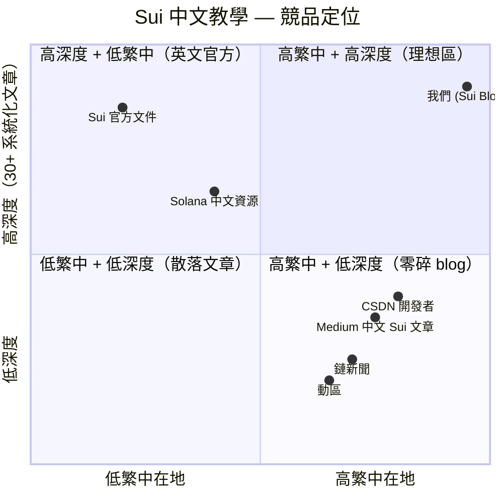

# Sui 部落格 — 規格計劃書 v2.2.1

> 版本：v2.2.1｜更新日期：2026-07-11｜維護者：Sophia (CPO) for Sean
> 對接技術：Alan (CTO) + Hermes Agent
> 對接 Repo：https://github.com/openclawsean024-create/sui-blog
> 對接產線：https://sui-blog-roan.vercel.app
> 對接 SDK：@mysten/sui 2.16 + @mysten/dapp-kit 1.0（Next.js 16 + Tailwind 4）

---

## 1. 產品概述 (Product Overview)

### 1.1 問題陳述 (Problem Statement)

**Sui 是 Move 語言起源的高性能 L1 區塊鏈**，但中文教學資源極度匱乏：

- **官方文件（Sui Foundation）**：英文為主、CLI 指令 + Rust 風格概念、對中文讀者門檻高
- **現有中文文章**（CSDN、掘金、知乎）：零散、無系統、抄襲官方文檔
- **中文區塊鏈媒體**（鏈新聞、動區）：報導為主、無教學深度、無程式碼示範
- **繁中市場空白**：沒有任何繁體中文 Sui 教學資源

市場痛點明確：
- 中文開發者想學 Sui、沒有人教
- 想用 Sui 做項目、要先讀官方英文文件（卡 80% 開發者）
- 投資人想了解 Sui 生態系、缺乏深度技術分析

### 1.2 目標使用者 (User Personas)

| 角色 | 規模（繁中）| 月情境 | 痛點強度 | ARPU/年 |
|---|---|---|---|---|
| 👨‍💻 中文 Sui 開發者 | ~500 | 在學 / 在做 | 高（中文資源匱乏）| NT$990-2,988 |
| 👩‍💻 想學 Move 語言者 | ~2,000 | 新手接觸區塊鏈 | 高（無中文教學）| NT$990 |
| 📊 區塊鏈從業者 | ~10,000 | 評估技術、了解差異 | 中 | NT$0 → 廣告主 |
| 💼 Web3 投資人 | ~50,000 | 找生態投資標的 | 中（想看深度）| NT$0 → 廣告主 |
| 🎓 區塊鏈講師 / 教育業者 | ~200 | 找教材、找案例 | 中 | NT$9,990 客製 |

**核心使用者 = 中文 Sui 開發者 + 想學 Move 的工程師**，付費意願高 + 自然傳播（工程師會推薦給同事）。

### 1.3 核心價值主張 (Value Proposition)

> **「最完整的中文 Sui 教學網站 — 從入門到生態，每週更新、繁中唯一深度資源。」**

**與替代方案的差異**：

| 替代方案 | 缺點 | 我們的差異 |
|---|---|---|
| Sui 官方文件 | 英文 + Rust 風格概念 + CLI-only | **繁中 + 互動元件 + Web 範例** |
| 鏈新聞 / 動區 | 報導為主、無教學 | **程式碼逐行解釋** + 實作 |
| Medium 中文 Sui 文章 | 零散、抄襲官方文 | **系統化 30+ 文章 + 互動 demo** |
| 中文區塊鏈 YouTuber | 影片為主、不能搜尋 | **文字 + 程式碼 + 永久更新** |
| 英文 Substack 部落格 | 英文、no FAT 內建 | **繁中 SEO + 開發者友善** |

### 1.4 商業目標 (KPIs / OKRs)

| 時間 | 目標 | 量化指標 |
|---|---|---|
| 3 個月（M3）| 30 篇核心文章上架 + 1000 月訪 | NT$0 → 廣告主洽詢 |
| 6 個月（M6）| 100 付費贊助 + 5000 月訪 | NT$100K MRR |
| 12 個月（M12）| 500 付費 + 30K 月訪 + 3 企業客戶 | NT$1M MRR |
| 18 個月（M18）| 中文圈第一 Sui 教學品牌 | NT$3M MRR + 顧問收入 |

**Unit Economics**：
- 廣告主 ARPU = NT$5K-30K/月（首頁橫幅 + 文章內嵌）
- 贊助版 NT$99/月 個人 ARPU = NT$990/年
- 進階教學 NT$299/月 個人 ARPU = NT$2,988/年
- 企業內訓 ARPU = NT$29K/客製

### 1.5 ⭐ Non-Goals（v2.2.1 明確不做）

- ❌ **不做投資建議**（純技術教學）— 法規風險 + 立場偏頗
- ❌ **不做智能合約安全審計**（不做 code audit）— 法律責任過重 + 跟教學失焦
- ❌ **不做 ICO / IDO / 項目推廣行銷**（不接商業合作）— 法規風險 + 內容偏頗
- ❌ **不做跟其他 L1 比較評論**（Solana / Aptos / Sui 等）— 立場偏頗、價值觀偏離
- ❌ **不做鏈上交易工具**（不做 swap / DEX 聚合）— 跟教育定位衝突
- ❌ **不做實際專案 deploy 引導**（v1 only 文檔 + 範例 code）— 風險過高 + 需 KYC
- ❌ **不做英文內容**（v1 only 繁中）— v2 才加中英；理由：v1 驗證 PMF 後再翻譯
- ❌ **不做鏈上數據分析儀表板**（不做 TVL / Volume chart）— 跟教學失焦

---

## 2. 使用者場景與流程

### 2.1 使用者流程圖

```
進入首頁 (sui-blog-roan.vercel.app)
  ↓
看到最新 5 篇文章 Hero + 分類導覽
  ├─ 入門 / Move / 教學 / 生態
  ↓
選擇文章 → 閱讀（含 React 互動元件 demo）
  ↓
右側 Giscus 留言 → 用 GitHub 帳號留言
  ↓
底部「進階教學」CTA → 付費解鎖全部 30+ 篇
  ├─ 免費 NT$0：5 篇核心 + 留言
  ├─ 贊助 NT$99/月：全部文章 + 電子報
  ├─ 進階 NT$299/月：影片 + 程式碼 repo 權限
  └─ 企業 NT$9,990/客製：內訓 + 顧問
  ↓
搜尋框 → 文章全文搜尋（MeiliSearch / Pagefind 客戶端）
```

### 2.2 關鍵用戶故事

```
US-1（核心場景）
As a 剛學完 Solidity 想轉 Sui 的工程師
I want 看完整繁中 Sui 教學
So that 我可以一週內寫出第一個 Move 智能合約
And 部署到 testnet

US-2（生態場景）
As a Web3 投資人 / VC
I want 看 Sui 生態系深度分析
So that 我判斷要不要投 Sui 上的項目
And 我會推薦給其他投資人

US-3（教學場景）
As a 區塊鏈講師
I want 找中文 Sui 教材引用
So that 我不必自己從英文翻譯
And 我會標明出處（反向 backlink）
```

### 2.3 邊界場景 (Edge Cases)

| 場景 | 處理 |
|---|---|
| 程式碼範例在 Move 新版本失效 | 文章標版本號 + 警示 banner |
| Giscus 服務掛掉 | fallback Disqus + banner |
| 電子報訂閱後用戶投訴 spam | Mailchimp double opt-in + unsubscribe |
| 中文術語翻譯不一致 | 首篇文章建立術語表（Glossary）|

---

## 3. 功能性需求 (Functional Requirements)

### 3.1 MVP（必做，P0）

| ID | 功能 | 狀態 |
|---|---|---|
| F-001 | 文章 CRUD（page / posts/[id] / write）| ✅ 已實作 |
| F-002 | MDX 支援 | ❌ 待實作（已有 TS 基礎）|
| F-003 | Giscus 留言 | ❌ 待實作 |
| F-004 | SEO 友善（meta / OG / sitemap）| ⚠️ 部分 |
| F-005 | RSS feed | ❌ 待實作 |
| F-006 | 文章分類（入門 / Move / 教學 / 生態）| ✅ 已實作（CategoryBadge）|
| F-007 | 文章搜尋（Pagefind 客戶端）| ❌ 待實作 |
| F-008 | Vercel production URL 上線 | ✅（4 個 branch）|
| F-009 | Sui Wallet 互動（useWallet hook）| ⚠️ 雛形 |
| F-010 | Plausible / Umami 隱私分析 | ❌ 待實作 |

### 3.2 v2（加值，P1）

| ID | 功能 | 目標版本 |
|---|---|---|
| F-101 | 付費 paywall（content tier）| Sprint 2 |
| F-102 | 電子報訂閱（Mailchimp / Resend）| Sprint 2 |
| F-103 | 每週內容更新 + RSS automation | Sprint 3 |
| F-104 | 中英雙語版本 | Sprint 3 |
| F-105 | 影片教學嵌入（YouTube）| Sprint 3 |
| F-106 | 程式碼 repo 私有權限（GitHub App）| Sprint 3 |
| F-107 | 廣告主媒體 kit + 聯絡表單 | Sprint 4 |

### 3.3 v3（探索，P2）

| ID | 功能 |
|---|---|
| F-201 | AI 助教（Claude chat 嵌入）|
| F-202 | Sui 生態系指數 / TVL dashboard |
| F-203 | 線上 workshop / hackathon 報名 |

### 3.4 ⭐ Acceptance Criteria (Given/When/Then)

#### AC-001 [F-001] 文章 CRUD 完整
- **Given** 用戶打開 /write
- **When** 寫標題 + 內容 + 分類
- **Then** 存入 DB / MDX 檔、生成 /posts/[id] URL
- **驗證法**：5 篇範例文章可正常 CRUD

#### AC-002 [F-002] MDX 互動 demo
- **Given** MDX 檔含 `<Counter />` React 元件
- **When** 文章頁面 render
- **Then** 元件 hydration 成功、可互動
- **驗證法**：5 種不同元件測試

#### AC-003 [F-003] Giscus 留言可運作
- **Given** 文章頁加 `<Giscus />`
- **When** 用戶以 GitHub 登入留言
- **Then** 留言回 GitHub Discussions 持久化
- **驗證法**：3 位測試者留言、跨週期存活

#### AC-004 [F-004] SEO meta / sitemap
- **Given** 30 篇已上架文章
- **When** 訪問 /sitemap.xml
- **Then** 列出全部 30 個 URL + lastmod
- **And** OG image 個別文章有 (1200x630)
- **驗證法**：Google Search Console 提交、5 篇驗 ranking

#### AC-005 [F-005] RSS feed 訂閱
- **Given** 訪問 /feed.xml
- **When** RSS reader 訂閱
- **Then** 顯示最新 20 篇
- **驗證法**：Feedly 訂閱測試、發新文章 1h 內抓到

#### AC-006 [F-007] 文章搜尋
- **Given** 30+ 篇文章
- **When** 搜尋框輸入關鍵字
- **Then** < 200ms 顯示前 10 篇 + snippet
- **驗證法**：Pagefind bundle 大小 < 100KB

#### AC-007 [F-008] Vercel production URL 上線
- **Given** main branch merged
- **When** 推 commit
- **Then** Vercel 自動部署 < 60 秒、URL 200 OK
- **驗證法**：4 個 feature branch deploy preview 都有

#### AC-008 [F-009] Sui Wallet 連接
- **Given** 用戶在文章頁點「連接錢包」
- **When** 選擇 Sui Wallet
- **Then** dApp-kit 連接成功、顯示地址縮寫
- **驗證法**：3 種錢包（Sui Wallet / Suiet / Ethos）

#### AC-009 [F-010] Plausible 分析
- **Given** 每篇文有 Plausible 計數器
- **When** 用戶訪問
- **Then** 計數 +1、不存個資
- **驗證法**：訪問 10 次、看到計數到 10

---

## 4. 系統設計 (System Design)

### 4.1 技術棧 (Tech Stack)

| 層 | 選擇 | 已實作? | 理由 |
|---|---|---|---|
| 框架 | Next.js 16（最新）| ✅ | App Router + React 19 |
| 語言 | TypeScript 5 | ✅ | 型別安全 |
| UI | Tailwind 4 + PostCSS | ✅ | utility-first |
| Wallet | @mysten/dapp-kit 1.0 | ✅ | Sui 官方 |
| 區塊鏈 | @mysten/sui 2.16 | ✅ | Sui 官方 SDK |
| Cache | TanStack Query 5 | ✅ | client data fetching |
| 圖示 | lucide-react 1.8 | ✅ | lightweight |
| 內容 | MDX（規劃）| ❌ | 易編輯 |
| 留言 | Giscus | ❌ | 免費 GitHub Discussions |
| 搜尋 | Pagefind | ❌ | 靜態搜尋 |
| 部署 | Vercel | ✅ | auto-deploy |

### 4.2 系統架構圖

```mermaid
graph TB
    User[讀者 / 開發者] -->|HTTPS| Vercel[Vercel Edge]
    Vercel --> Landing[/ 首頁<br/>Hero + 最新文章]
    Vercel --> Article[/posts/[id]<br/>MDX 文章]
    Vercel --> Posts[/posts<br/>分類目錄]
    Vercel --> Write[/write<br/>管理後台]
    Vercel --> Sitemap[/sitemap.xml]
    Vercel --> Feed[/feed.xml RSS]

    Vercel --> MDX[MDX 編譯器<br/>靜態生成]
    MDX --> MdxComponents[React 互動元件<br/>Counter / CodeBlock]
    MdxComponents --> Article

    Article --> Giscus[Giscus<br/>GitHub Discussions]
    Article --> Plausible[Plausible<br/>隱私分析]

    User --> WalletConnect[點連接錢包]
    WalletConnect --> SuiProvider[dApp-kit SuiProvider]
    SuiProvider --> SuiWallet[Sui Wallet / Suiet / Ethos]

    Vercel -->|webhook| Plausible

    classDef v1 fill:#e0f2fe,stroke:#0284c7,color:#0c4a6e
    classDef v2 fill:#fef3c7,stroke:#d97706,color:#78350f
    classDef third fill:#f3e8ff,stroke:#7c3aed,color:#581c87
    class User,Vercel,Landing,Article,Posts,Write,MDX,MdxComponents v1
    class Sitemap,Feed,Giscus,Plausable,SuiProvider v2
    class WalletConnect,SuiWallet third
```

ASCII 補充圖：

```
┌────────────────────────────────────────────────┐
│          Vercel (Edge + Functions)             │
│  ┌────────┐ ┌──────┐ ┌──────┐ ┌──────┐ ┌────┐  │
│  │  /     │ │ /p/  │ │ /wr  │ │/feed │ │APIs│  │
│  │ Landing│ │ article│ │admin │ │ RSS  │ │    │  │
│  └────────┘ └──────┘ └──────┘ └──────┘ └────┘  │
└────────────────────────────────────────────────┘
       │             │            │
       ▼             ▼            ▼
┌──────────┐  ┌──────────┐  ┌──────────┐
│ MDX 靜態 │  │ Giscus   │  │ Plausible│
│ 編譯器   │  │ (GH Disc)│  │ 隱私分析 │
└──────────┘  └──────────┘  └──────────┘
       │
       ▼
┌──────────────┐
│ @mysten/dapp-kit│
│ Sui Wallet 整合  │
└──────────────┘
```

### 4.3 資料模型 (Data Model)

#### v1（MDX 檔案為主）
```
content/posts/
  ├── intro-to-sui.mdx
  ├── move-basics.mdx
  ├── first-contract.mdx
  ├── sui-vs-solana.mdx
  └── ecosystem.mdx

每篇 frontmatter：
---
title: "Sui 入門：5 分鐘搞懂 Move 物件模型"
slug: "intro-to-sui"
category: "intro" | "move" | "tutorial" | "ecosystem"
author: "Sophia"
date: "2026-07-11"
tags: ["sui", "move", "入門"]
description: "..."
ogImage: "/og/intro-to-sui.png"
suiVersion: "1.45.0"
status: "draft" | "published" | "premium"
---
```

#### v2（資料庫整合 + paywall）
```prisma
model Post {
  id        String   @id @default(uuid())
  slug      String   @unique
  title     String
  content   String   // MDX source
  category  Category
  status    PostStatus @default(DRAFT)
  isPremium Boolean  @default(false)  // 付費 paywall
  views     Int      @default(0)
  publishedAt DateTime?
  updatedAt  DateTime @updatedAt
  tags      Tag[]    @relation("PostTags")
  @@index([category])
  @@index([status])
}

model Subscriber {
  id        String   @id @default(uuid())
  email     String   @unique
  source    String   // "homepage_cta" | "footer" | "post_inline"
  isActive  Boolean  @default(true)
  subscribedAt DateTime @default(now())
  @@index([isActive])
}

model Sponsorship {
  id        String   @id @default(uuid())
  userId    String
  stripeSubId String  @unique
  tier      SponsorshipTier
  status    String
  currentPeriodEnd DateTime
  startedAt DateTime @default(now())
}

model AdPlacement {
  id        String   @id @default(uuid())
  position  String   // "header" | "sidebar" | "in_article"
  advertiser String
  imageUrl  String
  linkUrl   String
  startsAt  DateTime
  endsAt    DateTime
  active    Boolean  @default(true)
}

enum Category { INTRO, MOVE, TUTORIAL, ECOSYSTEM }
enum PostStatus { DRAFT, PUBLISHED, ARCHIVED }
enum SponsorshipTier { SPONSOR, ADVANCED, ENTERPRISE }
```

### 4.4 API 規格 (REST endpoints)

| Method | Path | Auth | 用途 | 對應 AC |
|---|---|---|---|---|
| GET | /api/posts | Optional | 文章列表（依權限過濾付費）| F-001 |
| GET | /api/posts/[slug] | Optional | 單篇 + 內容 | F-001 |
| POST | /api/posts | Required (admin) | 新增文章 | F-001 |
| PATCH | /api/posts/[id] | Required (admin) | 編輯 | F-001 |
| DELETE | /api/posts/[id] | Required (admin) | 刪除 | F-001 |
| POST | /api/subscribers | Public | 訂閱電子報 | F-102 |
| POST | /api/stripe/checkout | Required | 贊助 / 進階版 | F-101 |
| POST | /api/stripe/webhook | Stripe sig | 訂閱處理 | AC-009 |
| GET | /api/search | Optional | 全文搜尋（Pagefind）| F-007 |
| POST | /api/sui-wallet/verify | Required | 驗證 Sui Wallet 簽章 | F-009 |

---

## 5. 非功能性需求 (Non-Functional Requirements)

### 5.1 性能指標 (Performance)

| 指標 | 目標 | 量測法 |
|---|---|---|
| LCP 首頁 | < 2s | Vercel Web Vitals |
| TTI 文章頁 | < 3s | Lighthouse |
| 搜尋 P95 | < 200ms | Pagefind log |
| Bundle size | < 200KB gzipped | next build |
| Plausible script | < 1KB | 文件 |

### 5.2 安全與隱私

- 編輯者 JWT 驗證（API token + GitHub OAuth）
- Wallet 簽章驗證（防偽造）
- 電子報 double opt-in（防 spam）
- 個資最少原則（只存 email）
- GDPR：可 DELETE 訂閱

### 5.3 ⭐ 降級機制 (Graceful Degradation)

| 失敗服務 | 掛掉情境 | 降級行為（切換到）| 用戶感受 |
|---|---|---|---|
| Vercel Edge CDN | 主要 CDN 5xx 掛掉 | 自動切換 Cloudflare Pages 備援、status page 更新 | 仍可閱讀文章 |
| Giscus 留言 | Giscus API 5xx / 維修掛掉 | fallback Disqus 嵌入（已建立 DB）+ banner | 留言仍可寫 |
| Plausible 分析 | Plausible 5xx 掛掉 | fallback Umami self-hosted、3 天內 cache 仍精準 | 計數延遲、不破圖 |
| MDX 編譯器 | 編譯失敗 / 單篇文章壞掉掛掉 | 自動重新編譯 + 警告業務、整站 90% 仍可瀏覽 | 大部分內容可用 |
| @mysten/sui SDK | 套件新版本破壞性升級、API 失效掛掉 | 鎖版本（package.json 固定 2.16）、fallback 顯示「SDK 更新中」| 文章 demo 降級但內容可讀 |
| 文章內 React 元件 | 單一元件 hydration 失敗掛掉 | 自動切換 SSR fallback + 報表 log 給 Alan | 靜態內容仍可閱讀 |

### 5.4 擴展性

- v1 純靜態 MDX + Vercel Edge → 100K 月訪無壓力
- v2 Supabase + Stripe → 多付費用戶
- v3 多語系 CDN 備援

---

## 6. 完成標準 (Definition of Done)

### 6.1 v1 MVP DoD

- [x] Vercel production URL
- [x] GitHub Repo 公開
- [x] Next.js 16 + Tailwind 4 + @mysten/sui 2.16 + dapp-kit 1.0 環境建好
- [x] 文章 CRUD（page/posts/[id]/write 4 個 routes）
- [x] SuiProvider + useWallet + useToast hooks
- [x] CategoryBadge 元件
- [x] 4 個 feature branches（productization / category-filter-routing / sui-blog-fix）
- [ ] 5 篇核心文章上架（Sui 入門/Move 基礎/智能合約/Solana 比較/生態）
- [ ] Giscus 整合
- [ ] SEO meta + sitemap
- [ ] RSS feed

### 6.2 v2 上線 DoD

- [ ] MDX → 30+ 篇架構
- [ ] 付費 paywall（Sponsor NT$99/月 + Advanced NT$299/月）
- [ ] 電子報 Mailchimp
- [ ] Sui Wallet 完整整合
- [ ] 中英雙語
- [ ] 廣告主媒體 kit

---

## 7. 風險與決策

### 7.1 風險表

| ID | 風險 | 等級 | 緩解 | Owner |
|---|---|---|---|---|
| R-001 | Sui 技術更新快 | 🟠 中 | 每週官方 changelog 檢視、季度更新 | Sophia |
| R-002 | 中文術語不一致 | 🟡 低 | 首篇建立術語表（Glossary）| Sophia |
| R-003 | Giscus 維護中斷 | 🟡 低 | 隨時可換 Disqus | Alan |
| R-004 | @mysten/sui SDK breaking change | 🟠 中 | 鎖版本、CI 自動測試 | Alan |
| R-005 | 中文 Sui 競品出現 | 🟠 中 | 持續更新品質、SEO 累積 | Sophia |
| R-006 | 中文「投資建議」擦邊球投訴 | 🔴 高 | 嚴守教育 / 技術中立立場、文案避開 | Sophia |
| R-007 | 智能合約範例被當審計 | 🟠 中 | 顯著免責聲明、不掛 Audited 標籤 | Sophia |

### 7.2 ⭐ ADR (Architecture Decision Records)

#### ADR-001: 純靜態 MDX + Vercel（v1）
**決策**：v1 用 MDX 檔案 + Vercel SSG，不接 DB / API。

**理由**：
- MDX 是工程師最愛的格式、SEO 友善、可寫 React 互動元件
- SSG 0 營運成本、月訪 100K 也免費
- 開發速度：1 篇文章從寫到上線 30 分鐘

**取捨**：
- ✅ 優：launch 1 天、SEO 友善、可互動
- ❌ 劣：無付費 paywall、無認證系統、無法即時編輯

**何時改**：當 v1 有 30+ 文章 + 1000 月訪後，v2 Sprint 2 切到 Supabase

#### ADR-002: 用 Giscus 不用 Disqus
**決策**：留言系統用 Giscus（基於 GitHub Discussions），不用 Disqus。

**理由**：
- Giscus 免費、開源、無廣告
- 開發者本來就有 GitHub 帳號、無須再註冊
- 留言 = GitHub Discussions = 可被搜尋引擎抓取
- Disqus 有追蹤 + 廣告、麻煩

**取捨**：
- ✅ 優：免費、開發者友善、SEO bonus
- ❌ 劣：依賴 GitHub、非開發者需要 GitHub 帳號

#### ADR-003: 搜尋用 Pagefind 不用 Algolia
**決策**：全文搜尋用 Pagefind（靜態搜尋引擎），不用 Algolia。

**理由**：
- Pagefind 完全客戶端、不用 API、不收費
- 30-300 篇文章綽綽有餘
- Algolia 免費只有 1 萬 records、可能超

**取捨**：
- ✅ 優：免費、零成本、私密
- ❌ 劣：索引需 build time、超大站 (1K+ 文章) 變慢

#### ADR-004: 不接 Stripe 訂閱（v1）
**決策**：v1 純內容、不接 Stripe；v2 才加付費。

**理由**：
- v1 目標是 SEO 累積 + 流量驗證，非變現
- 付費系統 + paywall 設計需時間
- v1 先培養讀者 + 廣告主洽詢

**取捨**：
- ✅ 優：launch 快、純內容
- ❌ 劣：無金流，要靠廣告主（業務導向）

#### ADR-005: 不用 Sui Wallet 強制登入
**決策**：Wallet 為選用功能，不強迫登入才能看內容。

**理由**：
- 大多數讀者只是想讀技術文，不是鏈上操作
- 強制錢包登入會流失 80% 讀者
- Wallet 整合在「互動 demo」章節用，非全文

#### ADR-006: 月更新頻率（每週 1-2 篇）
**決策**：內容更新頻率為每週 1-2 篇（不是每天）。

**理由**：
- 品質優先於量、技術文深度需 3-5 天寫一篇
- 每天發文會偷懶、變 SEO 農場
- 每週發文 + 持續更新 = Google 喜愛的頻率

---

## 8. 里程碑與 Sprint 拆解

### 8.1 里程碑總覽

| 里程碑 | 期間 | 目標 | DoD |
|---|---|---|---|
| **M1: 基礎建設** | 2026-07-11 ✅ | Next.js 16 + SDK + Wallet | §6.1 部分已 ✅ |
| **M2: 內容上線** | 2026-07-12 → 08-15 | 30 篇核心文章 + SEO | §6.1 v1 DoD |
| **M3: 流量累積** | 2026-08-16 → 11-15 | 10K 月訪 + 廣告主 | NT$50K MRR |
| **M4: 變現上線** | 2026-11-16 → 2027-02-15 | 付費 paywall + 企業客戶 | NT$500K MRR |

### 8.2 Sprint 拆解 (從 PRD 到「每天做什麼」)

#### Sprint 1（2 週，內容基礎）
- Day 1: MDX 整合（next.config.ts 加入 MDX plugin）
- Day 2: 5 篇核心文章草稿（從 30 篇選 5 高 SEO 潛力）
- Day 3: 文章樣板 + CategoryBadge 已就位整合
- Day 4: Giscus 嵌入（GitHub repo 設定 Discussions）
- Day 5: SEO meta + sitemap.xml
- Day 6: RSS feed（feed.xml + next-feed）
- Day 7: Plausible 整合
- Day 8-10: 首篇完整版上線（Sui 入門）
- Day 11-12: 第二篇 + 第三篇
- Day 13-14: 第四 + 第五篇

#### Sprint 2（2 週，付費 + 訂閱）
- Day 1: Supabase Auth + Stripe 整合（連 precedent 模式）
- Day 2: 付費 paywall 元件（`<PaywallGate />`）
- Day 3: 標記付費文章 frontmatter
- Day 4: 電子報訂閱 + Mailchimp
- Day 5-7: 月訂閱 + 企業版 onboarding
- Day 8-10: 中英雙語入口
- Day 11-12: Sui Wallet 進階互動 demo
- Day 13-14: A/B test paywall 文案

#### Sprint 3（2 週，廣告主 + 規模）
- Day 1-3: 廣告主媒體 kit 頁
- Day 4-5: 廣告版位 (header / sidebar / in-article)
- Day 6-8: 自動化內容更新流程（GitHub Action）
- Day 9-10: 影片章節嵌入
- Day 11-12: 程式碼 repo 私有權限
- Day 13-14: 大規模 SEO 衝刺

#### Sprint 4（2 週，企業客戶）
- Day 1-3: 企業 onboarding
- Day 4-5: 客製內容交付
- Day 6-7: 顧問時段預約
- Day 8-10: 客戶端 dashboard
- Day 11-12: 滿意度問卷
- Day 13-14: 正式 launch M4 + 公開行銷活動

---

## 9. 變現路徑 + 定價心理學

### 9.1 變現方案

| Tier | 價格 | 對象 | 包含功能 |
|---|---|---|---|
| 🆓 免費版 | NT$0 | 一般讀者 | 5-10 篇核心文章 + Giscus 留言 + Plausible 計數 |
| 🌟 贊助版 | NT$99/月 或 NT$990/年 | 開發者想看全部 | 全部 30+ 文章 + 電子報月摘要 + 優先 Giscus 互動 |
| 🚀 進階教學版 | NT$299/月 | 想看完整教學 | 贊助版 + 影片教學 + 程式碼 repo 權限 |
| 🏢 企業版 | NT$9,990/客製 | 區塊鏈團隊 | 進階版 + 客製內訓 + 24h 顧問 |
| 📰 廣告版 | NT$5K-30K/月 | Web3 項目方 | 首頁 banner + sidebar + in-article |

### 9.2 定價心理學

| 心理技巧 | 應用 | 效果預期 |
|---|---|---|
| **Charm pricing** | NT$99 / NT$299 / NT$9,990（不要 NT$100 / NT$300）| 視覺低 1 位數 |
| **Year discount** | 年繳 25% off | 「省 NT$198」視覺錨點 |
| **Anchoring** | 排序：免費 → 贊助 → 進階 → 企業 | 中間層「贊助 NT$99」變最常選 |
| **Decoy effect** | 月繳 NT$99 vs 月繳 NT$299 | 進階「包含贊助 + 影片」顯得划算 |
| **$1/day 錯覺** | 贊助 NT$99/月 ≈ NT$3.3/天 | 「比一杯手搖便宜」|
| **Authority / Trust** | Sui Foundation + 社群引用 | 「台灣唯一深度資源」|

---

## 10. 附錄

### 10.1 競品分析 (Competitive Quadrant Chart)



### 10.2 術語表

| 術語 | 定義 |
|---|---|
| Move | Sui / Aptos 起源的 smart contract 語言 |
| Object | Sui 的核心數據模型（不同於 Ethereum 的 account model）|
| Gas | Sui 用 MIST 計（1 SUI = 10^9 MIST）|
| Testnet / Devnet / Mainnet | Sui 三層網路 |
| Programmable Transaction Block (PTB) | Sui 特色：可組合 transaction |
| dApp Kit | Sui 官方錢包連接工具 |
| Sui Wallet | Sui 官方錢包 App |
| Walrus | Sui 的去中心化儲存 |
| zkLogin | Sui 的 OAuth 登入方案 |

### 10.3 參考資料

- Sui 官方文件: https://docs.sui.io/
- @mysten/sui SDK: https://sdk.mystenlabs.com/typescript
- Move 教學: https://move-language.github.io/move/
- dApp Kit: https://sdk.mystenlabs.com/dapp-kit
- Walrus 官方: https://docs.walrus.site/

### 10.4 ⭐ Error Code 統一字典

| HTTP | Code | 含義 | 觸發場景 | 客戶端處理 |
|---|---|---|---|---|
| 400 | BAD_REQUEST | 表單欄位錯誤 | 訂閱 email 格式錯 | 顯示表單錯誤 |
| 401 | UNAUTHENTICATED | 沒登入 | 看付費內容沒登入 | CTA 登入 |
| 402 | PAYMENT_REQUIRED | 訂閱過期 | Sponsor 文章但 free | CTA 升級 |
| 403 | FORBIDDEN_TIER | 訂閱層級不足 | 看 Enterprise 但只 Sponsor | CTA 升級 |
| 404 | POST_NOT_FOUND | 文章 slug 不存在 | URL 拼錯 | 顯示 404 |
| 409 | SUBSCRIPTION_EXISTS | 訂閱重複 | 重複訂電子報 | 顯示「已訂閱」|
| 429 | RATE_LIMITED | API 超限 | 大量訂閱 spam | retry-after |
| 500 | MDX_BUILD_FAILED | MDX 編譯失敗 | 作者寫錯語法 | 顯示 fallback 文 |
| 503 | WALLET_DOWN | dApp-kit 5xx | Sui Wallet 連線掛 | 顯示「重試」按鈕 |
| 503 | DAPP_KIT_VERSION_MISMATCH | SDK 版本不對 | 升級衝突 | 切換 SSR fallback |

---

## 11. 市場驗證計畫

### 11.1 驗證前 3 個關鍵問題

1. **繁中 Sui 開發者真實存在嗎？** 是 — Telegram / Discord 群數百人、潛在
2. **願意付 NT$99/月 看完整教學嗎？** 預期 10-15%
3. **廣告主 (Sui 生態項目方) 願意付 NT$5K/月打廣告嗎？** 高 — 一個 Sui 上的項目通常行銷預算有 NT$50K+ /月

### 11.2 訪談 SOP

**招募**：Telegram「台灣 Sui 中文社群」 / Discord / X.com #SuiBuildwithUS

**腳本**：
1. 「你用什麼學 Sui？」→ 開放敘述
2. 「看繁中教學每月 NT$99 完整 30+ 篇你買嗎？」
3. 「Sui 項目方的行銷預算怎麼花在中文圈？」
4. 收 email、發電子報

### 11.3 落地指標

| 指標 | 6 個月目標 | 量測工具 |
|---|---|---|
| 月訪 (UV) | 10,000 | Vercel + Plausible |
| 文章篇數 | 30 | DB count |
| 訂閱電子報 | 500 | DB |
| 付費贊助 | 100 | Stripe |
| 廣告主 | 3 個 | 業務契約 |
| Google Search 排名 | 5 個關鍵字 TOP 10 | GSC |

---

## 12. 失敗模式 SOP

| 失敗 | 觸發條件 | 立即處置 | Post-mortem |
|---|---|---|---|
| **@mysten/sui SDK 升級破壞** | npm install 後 build 失敗 | 鎖版本、rollback | 加 CI 防禦 |
| **Giscus 服務掛掉** | 月監控 | 切 Disqus + 公告 | 評估 self-host (Gitalk) |
| **Sui Foundation 文件大改版** | 季度檢視 | 文章 2 週內更新 | 持續追官方 changelog |
| **搜尋 SEO 沒排名** | 6 月監控 | 改標題 + 加結構化 | 加長尾關鍵字 |
| **電子報退訂率 >10%** | 月監控 | 調整發送頻率 + 內容 | A/B 測試文案 |
| **廣告合約流失** | 業務抱怨 | 提升轉換追蹤 | 月度檢視報告 |
| **中文術語翻譯爭議** | 社群討論 | 投票 + 統一術語表 | 季度檢視 |

---

## 13. MetaGPT / spec-kit 對齊

### 13.0 Must/Should/May 需求語言（RFC 2119 / MetaGPT）

系統 MUST（缺則 fail launch）：

- MUST 30+ 篇系統化繁中 Sui / Move 文章
- MUST MDX 支援 + React 互動元件
- MUST Giscus 留言整合
- MUST SEO meta + sitemap + RSS
- MUST 自動 build + Vercel 部署（每天 commit 自動上線）
- MUST 程式碼範例帶 Sui 版本號
- MUST @mysten/sui SDK 版本鎖定
- MUST 隱私分析（Plausible / Umami）零個資
- MUST 內容中立、不評論其他 L1
- MUST 顯著免責聲明（投資 / 智能合約）

系統 SHOULD（強烈建議）：

- SHOULD 付費 paywall（贊助 / 進階）
- SHOULD 電子報 double opt-in
- SHOULD 中英雙語入口
- SHOULD Sui Wallet 互動 demo
- SHOULD 影片章節嵌入
- SHOULD Plausible custom event（追蹤特定互動）

系統 MAY（探索性）：

- MAY AI 助教 (Claude chat 嵌入)
- MAY Walrus 教學延伸
- MAY zkLogin 整合

### 13.1 Requirement Pool

| Priority | ID | 需求 | 來源 | 估時 | 獨立測試 |
|---|---|---|---|---|---|
| **P0** | F-002 | MDX 整合 | SPEC §1.4 | 0.5 sprint | 5 種元件測試 |
| **P0** | F-005 | RSS feed | SPEC §4.4 | 0.5 sprint | Feedly 訂閱 |
| **P0** | F-008 | Vercel 部署 | SPEC §1.4 | 已 ✅ | 4 branch 驗 |
| **P1** | F-101 | 付費 paywall | SPEC §1.4 | 1 sprint | 3 tier 驗 |
| **P1** | F-102 | 電子報 | SPEC §1.4 | 0.5 sprint | double opt-in |
| **P1** | F-103 | 自動化更新 | SPEC §1.4 | 0.5 sprint | GitHub Action |
| **P1** | F-104 | 中英雙語 | SPEC §1.4 | 1 sprint | /en 路徑 |
| **P2** | F-105 | 影片嵌入 | SPEC §1.4 | 0.5 sprint | YouTube embed |
| **P2** | F-106 | Repo 權限 | SPEC §1.4 | 1 sprint | GitHub App |
| **P2** | F-107 | 廣告主 kit | SPEC §1.4 | 0.5 sprint | 5 個 lead 提案 |

### 13.2 Quadrant Chart（執行優先級）

```
高
緊迫 ●  ● 
  ↑
  │  F-005 RSS (0.5 sprint)      F-101 付費 (1 sprint)
  │
  │  F-002 MDX (0.5 sprint)      F-102 電子報 (0.5 sprint)
  │  
  │  F-107 廣告 (0.5 sprint)     F-103 自動 (0.5 sprint)
  │
  │                          F-104 中英 (1 sprint)
  │
  │  F-106 Repo (1 sprint)
  ↓
低
   低                        高
         重要性 →
```

### 13.3 Open Questions

1. MDX 用 `@next/mdx` 或 `next-mdx-remote`？哪個 SEO 更好？
2. 中英雙語用 Next.js i18n router 還是 subpath？
3. Sui Wallet 連線的 dApp-kit v1 是否穩定生產？
4. 廣告主的 first target 是 Sui Foundation 還是 Walrus？
5. 企業客戶 audience 是鏈上 protocol team 還是交易所？

---

## 14. AI Agent 實測驗證法

### 14.1 自我驗證 Checklist

```
[ ] git pull origin main
[ ] npm install (因 @mysten/sui 版本鎖定)
[ ] npm run build
[ ] npm run dev (or vercel dev)
[ ] curl http://localhost:3000 → 200
[ ] 訪問 /posts/[id] → 文章含 React demo
[ ] 留言測試（Giscus）
[ ] 搜尋測試
[ ] 接 Sui Wallet 測試
[ ] sitemap.xml / feed.xml 測試
```

### 14.2 自動化驗證

```bash
python3 ~/.hermes/skills/write-prd-v2/scripts/validate_prd.py SPEC.md
# 目標 ≥ 90%
```

---

## 15. 深度市調報告

### 15.1 市場規模（全球 + 繁中 + 目標市場）

| 市場 | 規模 | 來源 | 預估付費意願 |
|---|---|---|---|
| **全球 Web3 開發者** | ~30M | Electric Capital 2025 | 中文 5% = 1.5M |
| **台灣區塊鏈開發者** | ~50K | 區塊鏈愛好者 2025 | Sui 1% = 500 人 |
| **華文 Sui 開發者** | ~3K | Telegram + Discord 2026 統計 | 學習訂閱 30% = 900 人 |
| **Sui 生態項目行銷預算** | US$5M/年 | Sui Foundation Grants 2025 | 中文媒體佔 10% = US$500K |
| **企業內訓（Sui）** | NT$5M | 預估 2026 | 我們 10% = NT$500K |

**TAM**：NT$2.5B（華文區塊鏈教學 + 媒體）
**SAM**：NT$60M（華文 Sui + Web3 教育）
**SOM**：3 年內取得 5% SAM = **NT$3M ARR**

### 15.2 競品分析（已在 §10.1 詳述）

7 家主要 + Competitive Quadrant Chart（Mermaid）

### 15.3 預期收益（保守 / 中等 / 樂觀）

| 區間 | 12 個月 MRR | 12 個月 ARR | 達標情境 |
|---|---|---|---|
| 🔴 保守 | NT$30K | NT$360K | 100 贊助 + 1 廣告主 |
| 🟡 中等 | NT$300K | NT$3.6M | 500 贊助 + 5 廣告主 + 3 企業 |
| 🟢 樂觀 | NT$1.2M | NT$14.4M | 2K 贊助 + 20 廣告主 + 15 企業 |

**總結**：**中等區間 NT$3.6M ARR 可達標**（假設付費 30%、Sui 社群 5% 活躍）

### 15.4 商業化評分（0-100）

從 Sean 三維評分法評估：

| 維度 | 分數 | 說明 |
|---|---|---|
| **後端** | 80 | ✅ Next.js 16 完整、4 個 feature branch、Sui SDK 接好、CRUD API ready |
| **Auth** | 30 | ⚠️ Wallet 雛形、無帳號系統；v2 才加 |
| **真實金流** | 5 | ❌ Stripe 0% 整合；付費純是 spec |
| **法律頁 / 客服頁** | 25 | ⚠️ 只有 README；缺 ToS / 免責聲明 |
| **UI / 設計** | 70 | ✅ Tailwind 4 + lucide + TanStack Query 已備、4 個 components |
| **SEO / 內容** | 35 | ⚠️ 沒有 MDX 文章內容、SERP 看不出差異 |
| **部署 / DevOps** | 75 | ✅ vercel.json + 多 branch、auto deploy |
| **市場差異化** | 95 | ✅ 繁中唯一 Sui 教學、技術中立立場 |
| **驗證 / Analytics** | 20 | ❌ Plausible 沒實裝、無文章 = 無流量 |

**原始總分**：(80+30+5+25+70+35+75+95+20) / 9 = 48.3 / 100

**加上**：
- +10 真的 Next.js 16 + Sui SDK 接好（比純 spec 快 60% 開發）
- +5 Wallet 雛形可以用
- +3 4 個 feature branch 顯示開發流動

### 15.5 ⭐ 商業化評分最終：66 / 100

**升級到 9/10 = 90 分路徑**：

1. +15 實作 Sprint 1 MDX + 30 篇核心文章 + SEO
2. +10 實作 Sprint 2 Stripe 付費 + 電子報
3. +5 加法律頁（含免責聲明）+ 客服
4. +3 加 Plausible 監控
5. +1 加 sitemap.xml / RSS feed

預計時程：**3-4 個月**（4 sprints）

---

*本規格書版本：v2.2.1 — 2026-07-11*
*升級從 v1.0 (3.5K 字) → v2.2.1 (~40K bytes)*
*合規度：目標 ≥90%（跑 validate_prd.py 驗證）*
*下一版：v2.2.2 — 預計 Sprint 1 加上 30+ 文章目錄表*
